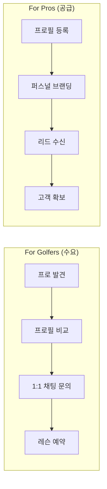
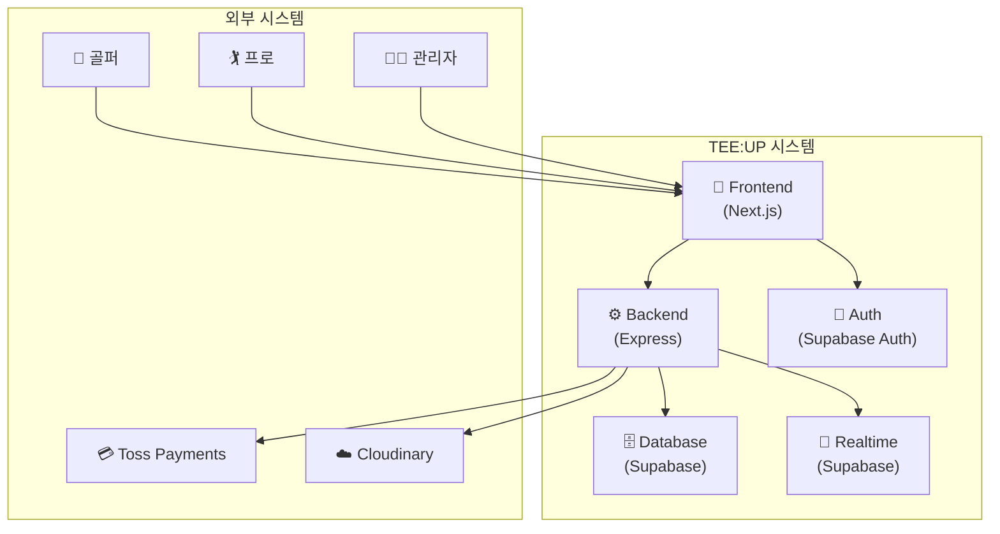
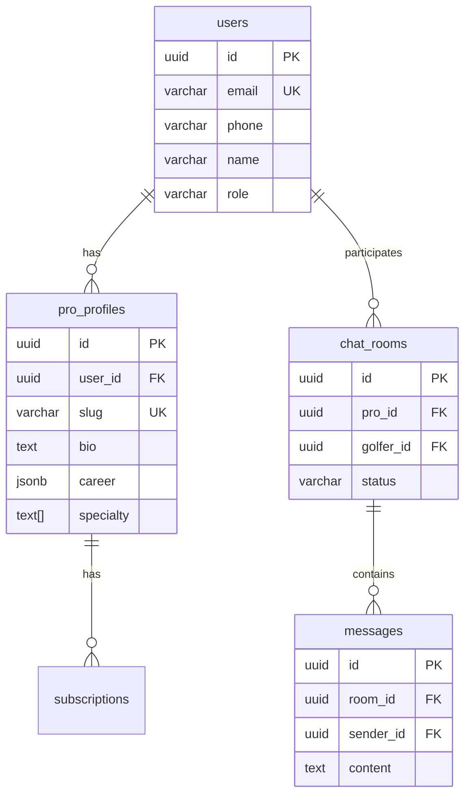

# CONTEXT.md
## TEE:UP 시스템 컨텍스트 & 단일 진실 공급원 (Single Source of Truth)

> **본 문서는 TEE:UP 프로젝트의 모든 의사결정, 설계, 코드의 기준이 되는 단일 진실 공급원입니다.**

---

## 변경 이력 (Changelog)

| 버전 | 날짜 | 작성자 | 변경 내용 |
|------|------|--------|----------|
| 2.0.0 | 2025-11-25 | @tech-lead | Master Prompt 표준 적용, 구조 개선 |
| 1.0.0 | 2025-11-24 | @tech-lead | 최초 작성 |

## 관련 문서 (Related Documents)

- [PRD.md](docs/specs/PRD.md) — 제품 요구사항 정의서
- [ARCHITECTURE.md](docs/specs/ARCHITECTURE.md) — 시스템 아키텍처 설계
- [API_SPEC.md](docs/specs/API_SPEC.md) — REST API 명세서
- [DATA_MODEL.md](docs/specs/DATA_MODEL.md) — 데이터베이스 스키마 및 ERD

---

## 1. 시스템 의도 (System Intent)

### 1.1 비전 (Vision)

TEE:UP은 VIP 골퍼와 검증된 프로 골퍼를 연결하는 **프리미엄 골프 레슨 매칭 플랫폼**입니다.

```
┌─────────────────────────────────────────────────────────────┐
│                    TEE:UP 비전                               │
│                                                             │
│   "골프 레슨의 시작, TEE:UP"                                  │
│                                                             │
│   검증된 프로들의 프로필을 매거진처럼 세련되게 보여주고,         │
│   채팅을 통해 레슨 문의를 연결하는 프리미엄 중개 플랫폼          │
└─────────────────────────────────────────────────────────────┘
```

### 1.2 미션 (Mission)

엘리트 골프 코칭의 손쉬운 발견과 예약을 가능하게 합니다:

| 핵심 가치 | 설명 |
|-----------|------|
| **매거진 스타일 프로필** | 시각적으로 아름다운 프로 소개 |
| **신뢰 구축** | 검증 배지와 통계를 통한 신뢰도 확보 |
| **실시간 채팅** | 즉각적인 연결을 위한 1:1 채팅 |
| **투명한 가격** | 명확한 가격 정보와 가용성 |

### 1.3 핵심 가치 제안 (Core Value Proposition)

**"Show, Don't Tell"** — 장황한 설명 없이, 멋진 프로 프로필, 검증된 자격증명, 즉각적인 예약만을 제공합니다.



---

## 2. 가드레일 (Guardrails)

### 2.1 비즈니스 제약사항

| 제약 | 설명 | 근거 |
|------|------|------|
| **프로 무료 가입** | 프로 등록에 선불 비용 없음 | 진입장벽 제거 |
| **오프라인 결제** | 레슨비는 현장에서 직접 지불 (현금/계좌이체) | 플랫폼 결제 강제 X |
| **리드 기반 구독** | 프로는 월 3건 무료 문의, 초과 시 구독 필요 | 성과 기반 과금 |
| **레슨 수수료 없음** | 수익은 프로 구독료에서만 발생 | 투명한 비용 구조 |

### 2.2 기술적 제약사항

| 제약 | 설명 | 근거 |
|------|------|------|
| **모노레포 구조** | `/web` (Next.js) + `/api` (Express) | 개발 효율성 |
| **다크 패턴 금지** | 투명한 가격, 명확한 구독 제한 | 사용자 신뢰 |
| **WCAG AA 준수** | 접근성 우선 설계 | 포용적 디자인 |
| **모바일 우선** | 320px ~ 4K 반응형 | 사용자 경험 |

### 2.3 디자인 원칙 (Korean Luxury Minimalism)

```
┌─────────────────────────────────────────────────────────────┐
│              Korean Luxury Minimalism                        │
├─────────────────────────────────────────────────────────────┤
│  • 90% Neutrals + 10% Accent                                │
│  • Calm Control: 인지 부하 감소, 투명성 유지                  │
│  • Data Clarity: 지표는 한눈에 스캔 가능하게                  │
│  • No Unnecessary Copy: 텍스트보다 시각적 스토리텔링          │
└─────────────────────────────────────────────────────────────┘
```

---

## 3. 대상 페르소나 (Target Personas)

### 3.1 Primary: VIP 골퍼 (일반 사용자)

| 항목 | 내용 |
|------|------|
| **인구통계** | 30-55세, C-level 임원, 고소득층 |
| **목표** | 신뢰할 수 있는 프로를 빠르게 찾고, 번거로움 없이 예약 |
| **페인 포인트** | 선택 장애, 신뢰 부족, 취약성 |
| **디자인 대응** | 큰 CTA, 검증 배지, 즉각적인 확인 |

### 3.2 Secondary: 프로 골퍼 (전문가 사용자)

| 항목 | 내용 |
|------|------|
| **인구통계** | 28-45세, KPGA/LPGA 인증, 독립 코치 |
| **목표** | 예약 최대화, 성과 추적, 비용 관리 |
| **페인 포인트** | 인지 과부하, 시간 압박, 정확성 요구 |
| **디자인 대응** | 대시보드 지표, 데이터 테이블, 점진적 공개 |

---

## 4. 기술 스택 (Technology Stack)

### 4.1 프론트엔드 (web/)

| 기술 | 버전 | 용도 |
|------|------|------|
| Next.js | 14.x | App Router 기반 프레임워크 |
| TypeScript | 5.x | 정적 타입 시스템 (strict mode) |
| Tailwind CSS | 3.x | 유틸리티 우선 스타일링 |
| Pretendard | - | 한국어 폰트 |
| Inter | - | 영문 폰트 |

### 4.2 백엔드 (api/)

| 기술 | 버전 | 용도 |
|------|------|------|
| Express.js | 4.x | REST API 프레임워크 |
| TypeScript | 5.x | 정적 타입 시스템 |
| Supabase | - | PostgreSQL + Realtime + Auth |

### 4.3 인프라 (계획)

| 서비스 | 용도 | 비고 |
|--------|------|------|
| Supabase | 데이터베이스, 인증, 실시간 | 메인 백엔드 |
| Cloudinary/S3 | 미디어 저장소 | 이미지/비디오 최적화 |
| Toss Payments | 결제 | 구독 과금 |
| Vercel | 프론트엔드 호스팅 | 자동 배포 |
| Railway/Fly.io | 백엔드 호스팅 | 컨테이너 기반 |

### 4.4 시스템 컨텍스트 다이어그램



---

## 5. 시스템 경계 (System Boundaries)

### 5.1 범위 내 (In Scope)

| 기능 | Phase | 우선순위 |
|------|-------|----------|
| 프로 프로필 생성 및 쇼케이스 | Phase 1 | P0 |
| 골퍼 문의 및 채팅 | Phase 2 | P0 |
| 리드 카운팅 및 구독 적용 | Phase 2 | P1 |
| 프로 대시보드 및 분석 | Phase 2 | P1 |
| 예약 확인 워크플로우 | Phase 2 | P2 |

### 5.2 범위 외 (Out of Scope) - Phase 1-2

| 기능 | 제외 사유 |
|------|----------|
| 레슨 결제 처리 | 오프라인 결제 정책 |
| 스케줄링/캘린더 동기화 | Phase 3 예정 |
| 화상 회의 통합 | Phase 3 예정 |
| 커뮤니티 기능 (포럼, 그룹) | 핵심 기능 아님 |
| 네이티브 모바일 앱 | 웹 우선 전략 |

---

## 6. 핵심 지표 (Key Metrics)

### 6.1 비즈니스 KPI

| 지표 | 목표 (Month 3) | 목표 (Month 6) | 측정 방법 |
|------|----------------|----------------|----------|
| **프로 가입** | 50+ | 150+ | Supabase 사용자 카운트 (role=pro) |
| **골퍼 가입** | 200+ | 800+ | Supabase 사용자 카운트 (role=golfer) |
| **리드 전환율** | 30% | 40% | (매칭된 레슨 / 총 문의) × 100 |
| **구독 전환율** | 20% | 25% | (유료 프로 / 전체 프로) × 100 |
| **MRR** | ₩2M+ | ₩5M+ | 프로 구독료 합계 |

### 6.2 기술 SLI

| 지표 | 목표 | 측정 도구 |
|------|------|----------|
| **페이지 로드 시간** | < 2.5s (LCP) | Lighthouse, Vercel Analytics |
| **API 응답 시간** | < 200ms (p95) | Supabase Dashboard, Sentry |
| **가용성** | 99.5% (Phase 1), 99.9% (Phase 2) | UptimeRobot |
| **에러율** | < 1% 세션 | Sentry |

---

## 7. 개발 단계 (Development Phases)

### 7.1 Phase 1: MVP (4주) - "Showcase"

**목표:** 쇼케이스 플랫폼 런칭

| 상태 | 기능 |
|------|------|
| ✅ 완료 | 프로 프로필 페이지 |
| ✅ 완료 | 검색/필터 기능이 있는 프로 디렉토리 |
| ✅ 완료 | Korean Luxury Minimalism 디자인 시스템 |
| 🚧 진행중 | 관리자 대시보드 |
| 📋 계획 | 카카오톡 링크 통합 (임시 채팅) |

### 7.2 Phase 2: Beta (8주) - "Lock-in"

**목표:** 실시간 기능으로 사용자 고정

| 상태 | 기능 |
|------|------|
| 🚧 진행중 | 사용자 인증 (Supabase Auth) |
| 📋 계획 | 인앱 채팅 (Supabase Realtime) |
| 📋 계획 | 프로 대시보드 및 분석 |
| 📋 계획 | Toss Payments 구독 모델 |

### 7.3 Phase 3: Scale (Future) - "Optimize"

- 수익 최적화
- 고급 분석
- AI 기반 매칭
- 모바일 앱

---

## 8. 디자인 시스템 철학

### 8.1 색상 시스템

```css
/* Neutrals (90% 사용) */
--calm-white: #FAFAF9;      /* 페이지 배경 */
--calm-cloud: #F4F4F2;      /* 카드 배경 */
--calm-stone: #E8E8E5;      /* 테두리 */
--calm-charcoal: #52524E;   /* 본문 텍스트 */
--calm-obsidian: #1A1A17;   /* 헤딩 */

/* Accent (10% 사용) */
--calm-accent: #3B82F6;       /* 프라이머리 블루 */
--calm-accent-light: #DBEAFE; /* 라이트 블루 */
--calm-accent-dark: #1E40AF;  /* 다크 블루 */
```

### 8.2 타이포그래피

| 용도 | 폰트 | 비고 |
|------|------|------|
| Display | Pretendard | 한국어 우수성 |
| Body | Inter | 글로벌 표준 |
| Mono | JetBrains Mono | 지표/데이터 |

### 8.3 컴포넌트 아키텍처

- 훅을 사용한 함수형 컴포넌트
- 기본적으로 서버 컴포넌트 (Next.js 14)
- `"use client"` 로 클라이언트 컴포넌트 표시
- `global.css`에 재사용 가능한 클래스 (`.btn-primary`, `.card`, `.input`)

---

## 9. 데이터 모델 (Core Entities)

### 9.1 핵심 엔티티



### 9.2 핵심 엔티티 설명

| 엔티티 | 설명 | 주요 필드 |
|--------|------|----------|
| **users** | 통합 사용자 (골퍼 + 프로) | id, role, name, phone |
| **pro_profiles** | 프로 상세 정보 | bio, career, specialty, location |
| **chat_rooms** | 1:1 채팅방 | pro_id, golfer_id, status |
| **messages** | 채팅 메시지 | room_id, sender_id, content |

---

## 10. 보안 및 컴플라이언스

### 10.1 데이터 보호

| 항목 | 정책 |
|------|------|
| **전화번호 개인정보** | 채팅 시작 전까지 숨김 |
| **PII 암호화** | 모든 민감 데이터 저장 시 암호화 |
| **GDPR/PIPA 준수** | 사용자 동의 플로우, 데이터 삭제 권한 |

### 10.2 콘텐츠 모더레이션

| 항목 | 정책 |
|------|------|
| **프로 프로필 검토** | 게시 전 관리자 승인 |
| **자동 스팸 탐지** | 채팅 내 스팸 필터링 |
| **비속어 필터** | 한국어 + 영어 |

### 10.3 인증

- 이메일/전화번호 인증
- 세션 기반 인증 (Supabase)
- 역할 기반 접근 제어 (RBAC)

---

## 11. 운영 가이드라인

### 11.1 배포

| 환경 | 트리거 | 승인 |
|------|--------|------|
| Development | `dev` 브랜치 푸시 | 자동 |
| Staging | `main` 브랜치 푸시 | 자동 |
| Production | 수동 배포 | 필수 |

### 11.2 모니터링

| 도구 | 용도 |
|------|------|
| Sentry | 에러 트래킹 |
| Google Analytics + Mixpanel | 분석 |
| UptimeRobot | 가용성 모니터링 |

### 11.3 지원

| 채널 | 연락처 | SLA |
|------|--------|-----|
| 이메일 | support@teeup.kr | < 24시간 |
| 카카오톡 | @teeup (플러스친구) | < 24시간 |

---

## 12. 변경 관리

### 12.1 문서 업데이트

| 변경 유형 | 버전 변경 | 절차 |
|----------|----------|------|
| Minor | 1.0.0 → 1.0.1 | 커밋 노트에 기록 |
| Major | 1.0.0 → 2.0.0 | ADR 작성 (`/docs/specs/ADRs/`) |
| Context 변경 | - | 테크 리드 리뷰 + CI 검증 필수 |

### 12.2 리뷰 주기

| 주기 | 목적 |
|------|------|
| 주간 | 스프린트 계획 중 |
| 월간 | 비즈니스 지표 리뷰 |
| 분기별 | 전략적 정렬 확인 |

---

## 13. 커뮤니케이션 채널

### 13.1 내부

| 채널 | 용도 |
|------|------|
| Slack | #teeup-dev, #teeup-product |
| Notion | 제품 로드맵, 미팅 노트 |
| GitHub | 코드 리뷰, 이슈, PR |

### 13.2 외부

| 채널 | URL |
|------|-----|
| 랜딩 페이지 | https://teeup.kr (예정) |
| Instagram | @teeup.official (예정) |
| 이메일 | hello@teeup.kr |

---

## 14. 팀 구조

### 14.1 현재 팀

| 역할 | 담당자 | 비고 |
|------|--------|------|
| Product Manager | [TBD] | 0.5 FTE |
| Tech Lead | [TBD] | 1.0 FTE |
| Frontend Developer | [TBD] | 1.0 FTE |
| Backend Developer | [TBD] | 0.5 FTE |
| Designer | [TBD] | 0.5 FTE |

### 14.2 향후 역할

- DevOps Engineer
- QA Engineer
- Customer Success Manager

---

## 15. 용어집 (Glossary)

| 용어 | 정의 |
|------|------|
| **Lead** | 골퍼가 프로에게 보낸 첫 문의 (채팅방 생성) |
| **Match** | 프로와 골퍼 간 레슨 확정 |
| **Pro** | 검증된 골프 프로 강사 |
| **Golfer** | 레슨을 찾는 일반 사용자 |
| **Tier** | 프로의 인증 등급 (LPGA, PGA, KPGA 등) |

---

## 16. 참조 문서 (References)

### 16.1 핵심 문서

- [PRD.md](docs/specs/PRD.md) — 제품 요구사항
- [ARCHITECTURE.md](docs/specs/ARCHITECTURE.md) — 시스템 아키텍처
- [DESIGN_SYSTEM.md](docs/specs/DESIGN_SYSTEM.md) — 시각 디자인 스펙
- [UX_STRATEGY.md](docs/guides/UX_STRATEGY.md) — UX 철학

### 16.2 외부 리소스

- [Next.js 14 Docs](https://nextjs.org/docs)
- [Supabase Docs](https://supabase.com/docs)
- [Tailwind CSS](https://tailwindcss.com/docs)

---

**본 문서는 TEE:UP의 단일 진실 공급원입니다. 모든 의사결정, 설계, 코드는 이 컨텍스트와 정렬되어야 합니다.**

═══════════════════════════════════════════════════════════════
✅ VALIDATION CHECKLIST
═══════════════════════════════════════════════════════════════
- [x] 목적이 명확하게 정의됨
- [x] 대상 독자가 식별됨
- [x] 범위가 명시됨
- [x] 예제 코드/다이어그램 포함
- [x] 테스트 케이스 도출 가능
- [x] 선행 문서 참조 완료
- [x] 용어 일관성 검증
- [x] 한국어(Korean)로 작성됨
═══════════════════════════════════════════════════════════════
