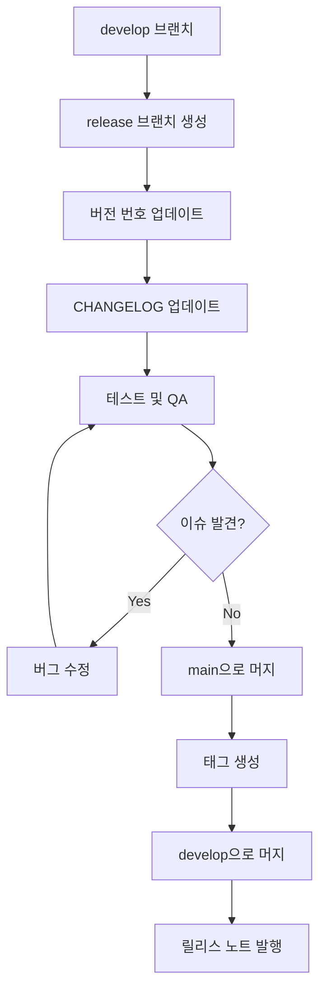

# VERSIONING_GUIDE.md

## Git 버전 관리 규칙

> **본 문서는 TEE:UP 프로젝트의 Git 버전 관리 전략과 규칙을 정의합니다.**

---

## 변경 이력 (Changelog)

| 버전 | 날짜 | 작성자 | 변경 내용 |
|------|------|--------|----------|
| 1.0.0 | 2025-11-25 | @tech-lead | 최초 작성 |

## 관련 문서 (Related Documents)

- [CONTRIBUTING.md](docs/guides/CONTRIBUTING.md) — 기여 가이드
- [RELEASE_MANAGEMENT.md](docs/operations/RELEASE_MANAGEMENT.md) — 릴리스 관리

---

## 1. Semantic Versioning

### 1.1 버전 형식

```
MAJOR.MINOR.PATCH[-PRERELEASE][+BUILD]

예시:
- 1.0.0        (정식 릴리스)
- 1.2.3        (패치 릴리스)
- 2.0.0-alpha  (프리릴리스)
- 2.0.0-beta.1 (베타 릴리스)
- 2.0.0-rc.1   (릴리스 후보)
```

### 1.2 버전 증가 규칙

| 변경 유형 | 버전 증가 | 예시 |
|----------|----------|------|
| **MAJOR** | 호환성 깨지는 변경 | 1.2.3 → 2.0.0 |
| **MINOR** | 하위 호환 기능 추가 | 1.2.3 → 1.3.0 |
| **PATCH** | 하위 호환 버그 수정 | 1.2.3 → 1.2.4 |

### 1.3 버전 증가 결정 트리

```
┌─────────────────────────────────────────────────────────────┐
│ 이 변경이 기존 API/동작을 깨뜨리나요?                         │
└─────────────────────────────────────────────────────────────┘
                          │
            ┌─────────────┴─────────────┐
            │ YES                       │ NO
            ▼                           ▼
     ┌─────────────┐        ┌─────────────────────────────┐
     │ MAJOR 증가  │        │ 새로운 기능이 추가되었나요?  │
     │ (X.0.0)    │        └─────────────────────────────┘
     └─────────────┘                    │
                          ┌─────────────┴─────────────┐
                          │ YES                       │ NO
                          ▼                           ▼
                   ┌─────────────┐            ┌─────────────┐
                   │ MINOR 증가  │            │ PATCH 증가  │
                   │ (X.Y.0)    │            │ (X.Y.Z)    │
                   └─────────────┘            └─────────────┘
```

---

## 2. 브랜치 전략

### 2.1 브랜치 구조

```
main (production)
  │
  ├── develop (integration)
  │     │
  │     ├── feature/xxx
  │     ├── feature/yyy
  │     └── bugfix/zzz
  │
  ├── release/x.y.z (release preparation)
  │
  └── hotfix/xxx (emergency fixes)
```

### 2.2 브랜치 역할

| 브랜치 | 용도 | 머지 대상 |
|--------|------|----------|
| `main` | 프로덕션 코드 | - |
| `develop` | 개발 통합 | main |
| `feature/*` | 새 기능 개발 | develop |
| `bugfix/*` | 버그 수정 | develop |
| `release/*` | 릴리스 준비 | main, develop |
| `hotfix/*` | 긴급 수정 | main, develop |

### 2.3 브랜치 명명 규칙

```bash
# 기능 브랜치
feature/123-add-chat-feature
feature/add-user-authentication

# 버그 수정 브랜치
bugfix/456-fix-login-error
bugfix/resolve-null-pointer

# 릴리스 브랜치
release/1.2.0
release/2.0.0-beta

# 핫픽스 브랜치
hotfix/security-patch
hotfix/critical-bug-fix
```

---

## 3. 커밋 컨벤션

### 3.1 Conventional Commits

```
<type>(<scope>): <subject>

[optional body]

[optional footer(s)]
```

### 3.2 Type 종류

| Type | 설명 | CHANGELOG | 버전 영향 |
|------|------|-----------|----------|
| `feat` | 새 기능 | Features | MINOR |
| `fix` | 버그 수정 | Bug Fixes | PATCH |
| `docs` | 문서 변경 | - | - |
| `style` | 코드 스타일 | - | - |
| `refactor` | 리팩토링 | - | - |
| `perf` | 성능 개선 | Performance | PATCH |
| `test` | 테스트 | - | - |
| `chore` | 빌드/설정 | - | - |

### 3.3 Breaking Changes

```bash
# BREAKING CHANGE 표시 방법

# 방법 1: footer에 명시
feat(api): change user endpoint response format

BREAKING CHANGE: User response now includes nested profile object.
Migrate existing clients to use user.profile.name instead of user.name.

# 방법 2: ! 사용
feat(api)!: change user endpoint response format
```

### 3.4 커밋 예시

```bash
# 새 기능
feat(chat): add real-time message delivery

Implement WebSocket connection for instant message updates.
Uses Supabase Realtime for subscription management.

Closes #123

# 버그 수정
fix(auth): resolve token refresh race condition

The refresh token was being invalidated before the new token
was stored, causing intermittent logout issues.

Fixes #456

# Breaking Change
feat(api)!: rename user endpoints to profiles

BREAKING CHANGE: /api/users is now /api/profiles
All clients need to update their API calls.

Migration guide: docs/migration/v2.md
```

---

## 4. 태그 전략

### 4.1 태그 형식

```bash
# 정식 릴리스
v1.0.0
v1.2.3
v2.0.0

# 프리릴리스
v1.0.0-alpha
v1.0.0-beta.1
v1.0.0-rc.1
```

### 4.2 태그 생성

```bash
# 태그 생성
git tag -a v1.2.0 -m "Release v1.2.0: Add chat feature"

# 태그 푸시
git push origin v1.2.0

# 모든 태그 푸시
git push origin --tags
```

### 4.3 Annotated vs Lightweight Tags

| 유형 | 용도 | 생성 방법 |
|------|------|----------|
| Annotated | 릴리스 (권장) | `git tag -a v1.0.0 -m "..."` |
| Lightweight | 임시/로컬 | `git tag v1.0.0-temp` |

---

## 5. 릴리스 프로세스

### 5.1 릴리스 워크플로우



### 5.2 릴리스 체크리스트

```markdown
## 릴리스 준비

- [ ] develop 브랜치 최신 상태 확인
- [ ] 모든 PR 머지 완료
- [ ] 모든 테스트 통과

## 릴리스 브랜치 생성

- [ ] `release/x.y.z` 브랜치 생성
- [ ] package.json 버전 업데이트
- [ ] CHANGELOG.md 업데이트

## 테스트 및 검증

- [ ] 스테이징 배포
- [ ] QA 테스트 완료
- [ ] 성능 테스트 완료

## 릴리스

- [ ] main 브랜치로 머지
- [ ] 태그 생성 및 푸시
- [ ] 프로덕션 배포
- [ ] 릴리스 노트 발행

## 사후 작업

- [ ] develop 브랜치로 머지
- [ ] 릴리스 브랜치 삭제
- [ ] 모니터링 확인
```

### 5.3 CHANGELOG 형식

```markdown
# Changelog

모든 주요 변경사항이 이 파일에 기록됩니다.

## [1.2.0] - 2025-11-25

### Added
- 실시간 채팅 기능 추가 (#123)
- 프로 프로필 검증 배지 (#124)

### Changed
- 프로필 페이지 디자인 개선 (#125)

### Fixed
- 로그인 시 토큰 갱신 오류 수정 (#126)

### Security
- 비밀번호 해싱 알고리즘 강화 (#127)

## [1.1.0] - 2025-11-20

### Added
- 프로 검색 필터 기능 (#100)
```

---

## 6. Hotfix 프로세스

### 6.1 Hotfix 워크플로우

```bash
# 1. main에서 hotfix 브랜치 생성
git checkout main
git checkout -b hotfix/critical-security-fix

# 2. 수정 작업
# ... 코드 수정 ...

# 3. 버전 업데이트 (PATCH 증가)
# package.json: 1.2.0 -> 1.2.1

# 4. 커밋
git commit -m "fix(security): patch XSS vulnerability"

# 5. main으로 머지
git checkout main
git merge hotfix/critical-security-fix
git tag -a v1.2.1 -m "Hotfix: Security patch"
git push origin main --tags

# 6. develop으로도 머지
git checkout develop
git merge hotfix/critical-security-fix
git push origin develop

# 7. hotfix 브랜치 삭제
git branch -d hotfix/critical-security-fix
```

### 6.2 Hotfix 기준

| 상황 | Hotfix 여부 |
|------|------------|
| 보안 취약점 | ✅ Yes |
| 서비스 장애 | ✅ Yes |
| 데이터 손실 위험 | ✅ Yes |
| 결제 오류 | ✅ Yes |
| UI 버그 | ❌ No (정규 릴리스) |
| 성능 저하 | ⚠️ 심각도에 따라 |

---

## 7. 버전 관리 도구

### 7.1 자동 버전 관리

```json
// package.json
{
  "scripts": {
    "version:patch": "npm version patch",
    "version:minor": "npm version minor",
    "version:major": "npm version major",
    "release": "standard-version"
  }
}
```

### 7.2 standard-version 설정

```javascript
// .versionrc.js
module.exports = {
  types: [
    { type: 'feat', section: 'Features' },
    { type: 'fix', section: 'Bug Fixes' },
    { type: 'perf', section: 'Performance' },
    { type: 'docs', hidden: true },
    { type: 'style', hidden: true },
    { type: 'refactor', hidden: true },
    { type: 'test', hidden: true },
    { type: 'chore', hidden: true }
  ],
  commitUrlFormat: 'https://github.com/org/tee-up/commit/{{hash}}',
  compareUrlFormat: 'https://github.com/org/tee-up/compare/{{previousTag}}...{{currentTag}}'
};
```

### 7.3 자동 CHANGELOG 생성

```bash
# standard-version 사용
npx standard-version

# 특정 버전으로 릴리스
npx standard-version --release-as 2.0.0

# 프리릴리스
npx standard-version --prerelease alpha
```

---

## 8. Git 설정

### 8.1 권장 Git 설정

```bash
# 사용자 설정
git config --global user.name "Your Name"
git config --global user.email "your.email@teeup.kr"

# 기본 브랜치명
git config --global init.defaultBranch main

# 자동 CRLF 처리
git config --global core.autocrlf input  # macOS/Linux
git config --global core.autocrlf true   # Windows

# 푸시 기본 동작
git config --global push.default current

# 병합 전략
git config --global pull.rebase true
```

### 8.2 .gitattributes

```
# 줄바꿈 처리
* text=auto
*.js text eol=lf
*.ts text eol=lf
*.json text eol=lf
*.md text eol=lf

# 바이너리 파일
*.png binary
*.jpg binary
*.gif binary
*.ico binary
*.woff2 binary
```

### 8.3 .gitignore

```bash
# 의존성
node_modules/
.pnpm-store/

# 빌드 출력
.next/
dist/
build/

# 환경 변수
.env
.env.local
.env.*.local

# IDE
.idea/
.vscode/
*.swp

# OS
.DS_Store
Thumbs.db

# 로그
*.log
npm-debug.log*

# 테스트
coverage/
.nyc_output/
```

---

## 9. 유용한 Git 명령어

### 9.1 브랜치 관리

```bash
# 원격 브랜치 동기화
git fetch --prune

# 머지된 브랜치 삭제
git branch --merged | grep -v main | xargs git branch -d

# 브랜치 추적 정보 확인
git branch -vv
```

### 9.2 히스토리 관리

```bash
# 깔끔한 로그 보기
git log --oneline --graph --all

# 특정 파일 변경 이력
git log --follow -p -- path/to/file

# 커밋 간 차이
git diff v1.0.0..v1.1.0
```

### 9.3 되돌리기

```bash
# 마지막 커밋 수정
git commit --amend

# 특정 커밋 되돌리기
git revert <commit-hash>

# 워킹 디렉토리 복원
git restore <file>

# 스테이징 취소
git restore --staged <file>
```

---

## 10. 베스트 프랙티스

### 10.1 DO

| 권장 사항 |
|----------|
| 작고 자주 커밋하기 |
| 의미 있는 커밋 메시지 작성 |
| 기능별로 브랜치 분리 |
| 정기적으로 원격 저장소와 동기화 |
| PR 전 셀프 리뷰 |

### 10.2 DON'T

| 지양 사항 |
|----------|
| main 브랜치에 직접 푸시 |
| 대용량 바이너리 파일 커밋 |
| 시크릿/민감정보 커밋 |
| force push (공유 브랜치) |
| 불필요한 머지 커밋 생성 |

---

**일관된 버전 관리는 안정적인 릴리스의 기반입니다.**

═══════════════════════════════════════════════════════════════
✅ VALIDATION CHECKLIST
═══════════════════════════════════════════════════════════════
- [x] 목적이 명확하게 정의됨
- [x] Semantic Versioning 설명
- [x] 브랜치 전략 포함
- [x] 커밋 컨벤션 포함
- [x] 릴리스 프로세스 포함
- [x] 실행 가능한 명령어
- [x] 한국어(Korean)로 작성됨
═══════════════════════════════════════════════════════════════
