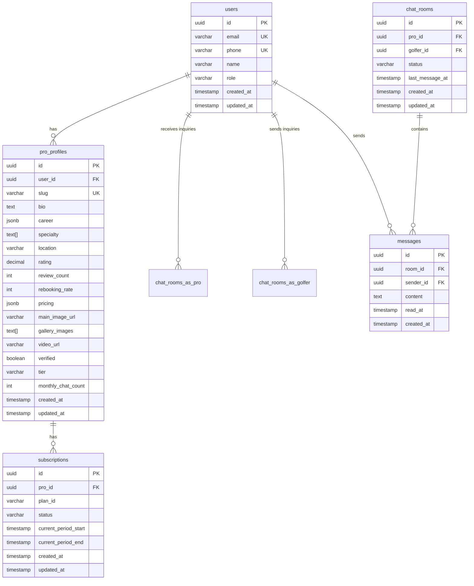

# Data Model & Database Schema

> **Version:** 1.0.0  
> **Last Updated:** 2025-11-24  
> **Database:** Supabase (PostgreSQL)  
> **Status:** Phase 2 (Planned)

---

## 📋 Overview

TEE:UP 프로젝트의 데이터베이스 스키마 및 데이터 모델을 정의합니다.

### Database Technology
- **DBMS:** PostgreSQL 15+ (via Supabase)
- **ORM:** Supabase Client (auto-generated TypeScript types)
- **Security:** Row Level Security (RLS) policies
- **Realtime:** Supabase Realtime subscriptions

---

## 🗂 Entity Relationship Diagram



---

## 📊 Table Definitions

### users
통합 사용자 테이블 (골퍼 + 프로)

| Column | Type | Constraints | Description |
|--------|------|-------------|-------------|
| `id` | uuid | PRIMARY KEY, DEFAULT uuid_generate_v4() | 사용자 ID |
| `email` | varchar(255) | UNIQUE, NOT NULL | 이메일 주소 |
| `phone` | varchar(20) | UNIQUE, NOT NULL | 전화번호 |
| `name` | varchar(100) | NOT NULL | 이름 |
| `role` | varchar(20) | NOT NULL, CHECK (role IN ('golfer', 'pro', 'admin')) | 사용자 역할 |
| `created_at` | timestamp | DEFAULT now() | 생성 시간 |
| `updated_at` | timestamp | DEFAULT now() | 수정 시간 |

**Indexes:**
```sql
CREATE INDEX idx_users_email ON users(email);
CREATE INDEX idx_users_phone ON users(phone);
CREATE INDEX idx_users_role ON users(role);
```

**RLS Policies:**
```sql
-- 사용자는 자신의 데이터만 읽을 수 있음
CREATE POLICY "Users can read own data"
  ON users FOR SELECT
  USING (auth.uid() = id);

-- 사용자는 자신의 데이터만 수정할 수 있음
CREATE POLICY "Users can update own data"
  ON users FOR UPDATE
  USING (auth.uid() = id);
```

---

### pro_profiles
프로 골퍼 확장 프로필 정보

| Column | Type | Constraints | Description |
|--------|------|-------------|-------------|
| `id` | uuid | PRIMARY KEY, DEFAULT uuid_generate_v4() | 프로필 ID |
| `user_id` | uuid | FOREIGN KEY → users(id), UNIQUE, NOT NULL | 사용자 ID |
| `slug` | varchar(100) | UNIQUE, NOT NULL | URL 슬러그 |
| `bio` | text | | 자기소개 |
| `career` | jsonb | | 경력 정보 (JSON) |
| `specialty` | text[] | | 전문 분야 배열 |
| `location` | varchar(100) | | 활동 지역 |
| `rating` | decimal(3,2) | DEFAULT 0.0 | 평균 평점 (0.0-5.0) |
| `review_count` | int | DEFAULT 0 | 리뷰 개수 |
| `rebooking_rate` | int | DEFAULT 0 | 재예약률 (%) |
| `pricing` | jsonb | | 가격 정보 (JSON) |
| `main_image_url` | varchar(500) | | 메인 이미지 URL |
| `gallery_images` | text[] | | 갤러리 이미지 URL 배열 |
| `video_url` | varchar(500) | | 소개 영상 URL |
| `verified` | boolean | DEFAULT false | 인증 여부 |
| `tier` | varchar(20) | | 프로 등급 (LPGA, PGA, etc.) |
| `monthly_chat_count` | int | DEFAULT 0 | 이번 달 채팅 개수 |
| `created_at` | timestamp | DEFAULT now() | 생성 시간 |
| `updated_at` | timestamp | DEFAULT now() | 수정 시간 |

**career JSONB Structure:**
```json
{
  "tourExperience": "LPGA 투어 5년",
  "achievements": ["2023 LPGA 챔피언십 우승"],
  "certifications": ["LPGA Class A"],
  "yearsOfExperience": 10
}
```

**pricing JSONB Structure:**
```json
{
  "individual": 150000,
  "group": 300000,
  "currency": "KRW"
}
```

**Indexes:**
```sql
CREATE INDEX idx_pro_profiles_user_id ON pro_profiles(user_id);
CREATE INDEX idx_pro_profiles_slug ON pro_profiles(slug);
CREATE INDEX idx_pro_profiles_location ON pro_profiles(location);
CREATE INDEX idx_pro_profiles_specialty ON pro_profiles USING GIN(specialty);
CREATE INDEX idx_pro_profiles_verified ON pro_profiles(verified);
```

**RLS Policies:**
```sql
-- 모든 사용자가 인증된 프로 프로필을 읽을 수 있음
CREATE POLICY "Anyone can read verified profiles"
  ON pro_profiles FOR SELECT
  USING (verified = true);

-- 프로는 자신의 프로필만 수정할 수 있음
CREATE POLICY "Pros can update own profile"
  ON pro_profiles FOR UPDATE
  USING (user_id = auth.uid());
```

---

### chat_rooms
1:1 채팅방

| Column | Type | Constraints | Description |
|--------|------|-------------|-------------|
| `id` | uuid | PRIMARY KEY, DEFAULT uuid_generate_v4() | 채팅방 ID |
| `pro_id` | uuid | FOREIGN KEY → users(id), NOT NULL | 프로 사용자 ID |
| `golfer_id` | uuid | FOREIGN KEY → users(id), NOT NULL | 골퍼 사용자 ID |
| `status` | varchar(20) | NOT NULL, CHECK (status IN ('active', 'matched', 'closed')) | 채팅방 상태 |
| `last_message_at` | timestamp | | 마지막 메시지 시간 |
| `created_at` | timestamp | DEFAULT now() | 생성 시간 |
| `updated_at` | timestamp | DEFAULT now() | 수정 시간 |

**Constraints:**
```sql
-- 같은 골퍼와 프로 간 중복 채팅방 방지
CREATE UNIQUE INDEX idx_chat_rooms_unique_pair 
  ON chat_rooms(pro_id, golfer_id) 
  WHERE status != 'closed';
```

**Indexes:**
```sql
CREATE INDEX idx_chat_rooms_pro_id ON chat_rooms(pro_id);
CREATE INDEX idx_chat_rooms_golfer_id ON chat_rooms(golfer_id);
CREATE INDEX idx_chat_rooms_status ON chat_rooms(status);
CREATE INDEX idx_chat_rooms_last_message_at ON chat_rooms(last_message_at DESC);
```

**RLS Policies:**
```sql
-- 채팅방 참여자만 읽을 수 있음
CREATE POLICY "Participants can read chat room"
  ON chat_rooms FOR SELECT
  USING (pro_id = auth.uid() OR golfer_id = auth.uid());

-- 골퍼만 새 채팅방을 생성할 수 있음
CREATE POLICY "Golfers can create chat room"
  ON chat_rooms FOR INSERT
  WITH CHECK (golfer_id = auth.uid());
```

---

### messages
채팅 메시지

| Column | Type | Constraints | Description |
|--------|------|-------------|-------------|
| `id` | uuid | PRIMARY KEY, DEFAULT uuid_generate_v4() | 메시지 ID |
| `room_id` | uuid | FOREIGN KEY → chat_rooms(id), NOT NULL | 채팅방 ID |
| `sender_id` | uuid | FOREIGN KEY → users(id), NOT NULL | 발신자 ID |
| `content` | text | NOT NULL, CHECK (length(content) <= 1000) | 메시지 내용 |
| `read_at` | timestamp | | 읽은 시간 |
| `created_at` | timestamp | DEFAULT now() | 생성 시간 |

**Indexes:**
```sql
CREATE INDEX idx_messages_room_id ON messages(room_id);
CREATE INDEX idx_messages_sender_id ON messages(sender_id);
CREATE INDEX idx_messages_created_at ON messages(created_at DESC);
CREATE INDEX idx_messages_room_created ON messages(room_id, created_at DESC);
```

**RLS Policies:**
```sql
-- 채팅방 참여자만 메시지를 읽을 수 있음
CREATE POLICY "Participants can read messages"
  ON messages FOR SELECT
  USING (
    EXISTS (
      SELECT 1 FROM chat_rooms
      WHERE chat_rooms.id = messages.room_id
      AND (chat_rooms.pro_id = auth.uid() OR chat_rooms.golfer_id = auth.uid())
    )
  );

-- 채팅방 참여자만 메시지를 보낼 수 있음
CREATE POLICY "Participants can send messages"
  ON messages FOR INSERT
  WITH CHECK (
    sender_id = auth.uid() AND
    EXISTS (
      SELECT 1 FROM chat_rooms
      WHERE chat_rooms.id = messages.room_id
      AND (chat_rooms.pro_id = auth.uid() OR chat_rooms.golfer_id = auth.uid())
    )
  );
```

---

### subscriptions
프로 구독 정보

| Column | Type | Constraints | Description |
|--------|------|-------------|-------------|
| `id` | uuid | PRIMARY KEY, DEFAULT uuid_generate_v4() | 구독 ID |
| `pro_id` | uuid | FOREIGN KEY → users(id), NOT NULL | 프로 사용자 ID |
| `plan_id` | varchar(50) | NOT NULL | 플랜 ID (basic, pro, premium) |
| `status` | varchar(20) | NOT NULL, CHECK (status IN ('active', 'canceled', 'expired')) | 구독 상태 |
| `current_period_start` | timestamp | NOT NULL | 현재 기간 시작 |
| `current_period_end` | timestamp | NOT NULL | 현재 기간 종료 |
| `created_at` | timestamp | DEFAULT now() | 생성 시간 |
| `updated_at` | timestamp | DEFAULT now() | 수정 시간 |

**Indexes:**
```sql
CREATE INDEX idx_subscriptions_pro_id ON subscriptions(pro_id);
CREATE INDEX idx_subscriptions_status ON subscriptions(status);
CREATE INDEX idx_subscriptions_period_end ON subscriptions(current_period_end);
```

**RLS Policies:**
```sql
-- 프로는 자신의 구독 정보만 읽을 수 있음
CREATE POLICY "Pros can read own subscription"
  ON subscriptions FOR SELECT
  USING (pro_id = auth.uid());
```

---

## 🔄 Database Functions

### update_updated_at_column()
`updated_at` 컬럼을 자동으로 업데이트하는 트리거 함수

```sql
CREATE OR REPLACE FUNCTION update_updated_at_column()
RETURNS TRIGGER AS $$
BEGIN
  NEW.updated_at = now();
  RETURN NEW;
END;
$$ LANGUAGE plpgsql;

-- 모든 테이블에 트리거 적용
CREATE TRIGGER update_users_updated_at
  BEFORE UPDATE ON users
  FOR EACH ROW EXECUTE FUNCTION update_updated_at_column();

CREATE TRIGGER update_pro_profiles_updated_at
  BEFORE UPDATE ON pro_profiles
  FOR EACH ROW EXECUTE FUNCTION update_updated_at_column();

CREATE TRIGGER update_chat_rooms_updated_at
  BEFORE UPDATE ON chat_rooms
  FOR EACH ROW EXECUTE FUNCTION update_updated_at_column();

CREATE TRIGGER update_subscriptions_updated_at
  BEFORE UPDATE ON subscriptions
  FOR EACH ROW EXECUTE FUNCTION update_updated_at_column();
```

### increment_monthly_chat_count()
새 채팅방 생성 시 프로의 월간 채팅 카운트 증가

```sql
CREATE OR REPLACE FUNCTION increment_monthly_chat_count()
RETURNS TRIGGER AS $$
BEGIN
  UPDATE pro_profiles
  SET monthly_chat_count = monthly_chat_count + 1
  WHERE user_id = NEW.pro_id;
  RETURN NEW;
END;
$$ LANGUAGE plpgsql;

CREATE TRIGGER increment_chat_count_on_room_create
  AFTER INSERT ON chat_rooms
  FOR EACH ROW EXECUTE FUNCTION increment_monthly_chat_count();
```

### reset_monthly_chat_counts()
매월 1일 모든 프로의 채팅 카운트 리셋 (Cron job)

```sql
CREATE OR REPLACE FUNCTION reset_monthly_chat_counts()
RETURNS void AS $$
BEGIN
  UPDATE pro_profiles
  SET monthly_chat_count = 0;
END;
$$ LANGUAGE plpgsql;

-- Supabase Cron으로 매월 1일 00:00에 실행
-- (Supabase Dashboard에서 설정)
```

---

## 📝 Sample Data

### Sample User (Golfer)
```sql
INSERT INTO users (id, email, phone, name, role)
VALUES (
  'a1b2c3d4-e5f6-7890-abcd-ef1234567890',
  'golfer@example.com',
  '010-1234-5678',
  '홍길동',
  'golfer'
);
```

### Sample User (Pro)
```sql
INSERT INTO users (id, email, phone, name, role)
VALUES (
  'b2c3d4e5-f6a7-8901-bcde-f12345678901',
  'pro@example.com',
  '010-9876-5432',
  '김지영',
  'pro'
);
```

### Sample Pro Profile
```sql
INSERT INTO pro_profiles (
  user_id, slug, bio, career, specialty, location, 
  rating, review_count, rebooking_rate, pricing,
  main_image_url, verified, tier
)
VALUES (
  'b2c3d4e5-f6a7-8901-bcde-f12345678901',
  'kim-jiyoung',
  'LPGA 투어 5년 경력의 프로 골퍼입니다.',
  '{"tourExperience": "LPGA 투어 5년", "achievements": ["2023 LPGA 챔피언십 우승"], "certifications": ["LPGA Class A"]}'::jsonb,
  ARRAY['driver', 'iron'],
  '강남구',
  4.9,
  127,
  89,
  '{"individual": 150000, "group": 300000, "currency": "KRW"}'::jsonb,
  'https://example.com/kim-jiyoung.jpg',
  true,
  'LPGA'
);
```

---

## 🔐 Security Considerations

### Row Level Security (RLS)
모든 테이블에 RLS 활성화:
```sql
ALTER TABLE users ENABLE ROW LEVEL SECURITY;
ALTER TABLE pro_profiles ENABLE ROW LEVEL SECURITY;
ALTER TABLE chat_rooms ENABLE ROW LEVEL SECURITY;
ALTER TABLE messages ENABLE ROW LEVEL SECURITY;
ALTER TABLE subscriptions ENABLE ROW LEVEL SECURITY;
```

### Data Encryption
- **At Rest:** Supabase 자동 암호화
- **In Transit:** HTTPS/TLS 1.3
- **Sensitive Fields:** `phone`, `email` 암호화 권장

---

## 📈 Performance Optimization

### Indexing Strategy
- Primary keys: 자동 인덱스
- Foreign keys: 명시적 인덱스
- 검색 필드: `location`, `specialty`, `verified`
- 정렬 필드: `created_at`, `last_message_at`

### Query Optimization
- N+1 문제 방지: JOIN 사용
- 페이지네이션: `LIMIT` + `OFFSET` 또는 Cursor-based
- Full-text search: PostgreSQL `tsvector` 사용 (Phase 3)

---

**이 스키마는 Phase 2 구현 시 Supabase에 적용됩니다.**
