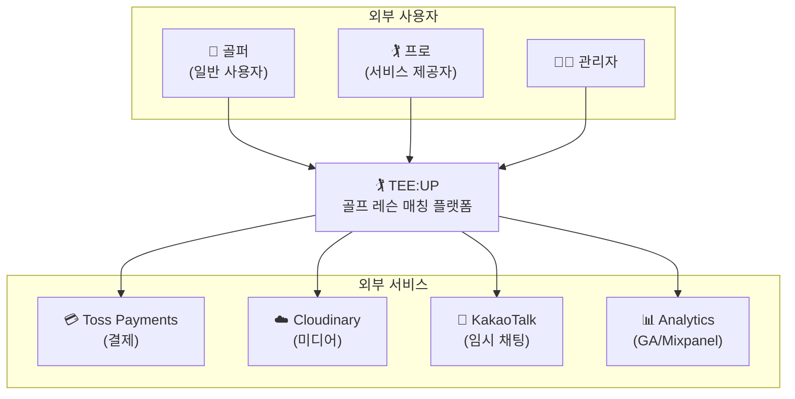
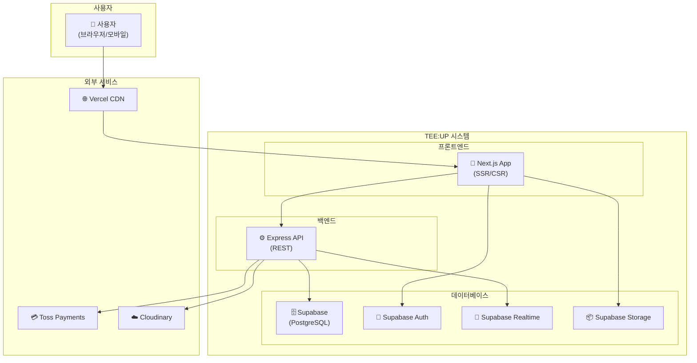
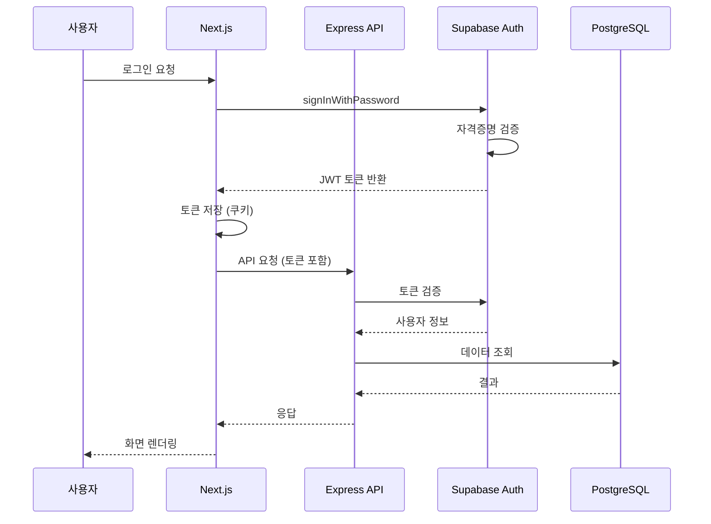
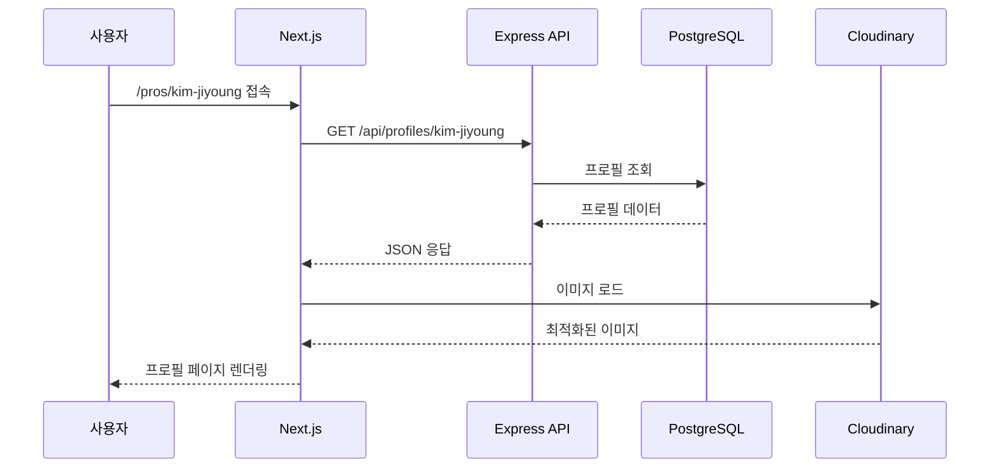
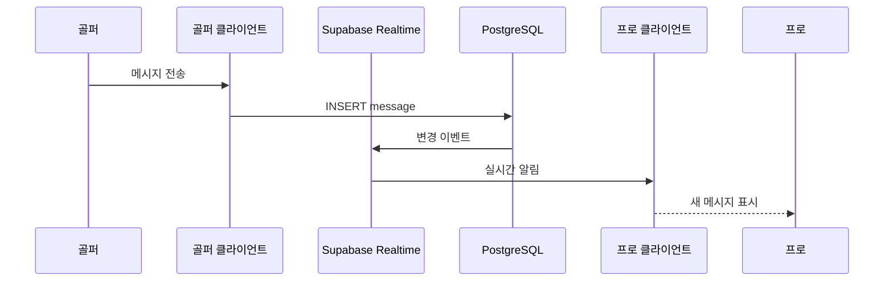
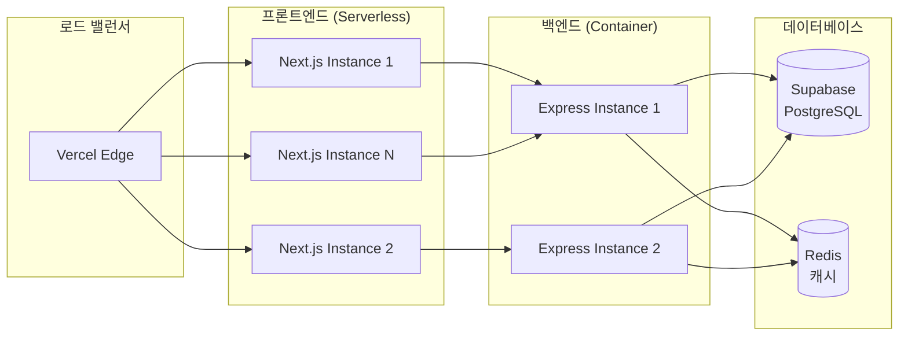

# ARCHITECTURE.md

## 시스템 아키텍처 설계

> **본 문서는 TEE:UP 플랫폼의 시스템 아키텍처를 정의합니다.**

---

## 변경 이력 (Changelog)

| 버전 | 날짜 | 작성자 | 변경 내용 |
|------|------|--------|----------|
| 1.0.0 | 2025-11-25 | @tech-lead | 최초 작성 |

## 관련 문서 (Related Documents)

- [CONTEXT.md](../../CONTEXT.md) — 시스템 컨텍스트
- [API_SPEC.md](API_SPEC.md) — REST API 명세
- [DATA_MODEL.md](DATA_MODEL.md) — 데이터베이스 스키마
- [ADR-0001-tech-stack.md](ADRs/ADR-0001-tech-stack.md) — 기술 스택 결정

---

## 1. 아키텍처 개요

### 1.1 시스템 컨텍스트 다이어그램 (C4 Level 1)



### 1.2 컨테이너 다이어그램 (C4 Level 2)



---

## 2. 기술 스택

### 2.1 프론트엔드

| 기술 | 버전 | 용도 | 선택 이유 |
|------|------|------|----------|
| **Next.js** | 14.x | 풀스택 프레임워크 | SSR/SSG, App Router, 최신 React 지원 |
| **React** | 18.x | UI 라이브러리 | 컴포넌트 기반, 풍부한 생태계 |
| **TypeScript** | 5.x | 정적 타입 | 타입 안전성, 개발 생산성 |
| **Tailwind CSS** | 3.x | 스타일링 | 유틸리티 우선, 빠른 개발 |
| **Zustand** | 4.x | 상태 관리 | 경량, 간단한 API |

### 2.2 백엔드

| 기술 | 버전 | 용도 | 선택 이유 |
|------|------|------|----------|
| **Express.js** | 4.x | API 서버 | 유연성, 미들웨어 생태계 |
| **TypeScript** | 5.x | 정적 타입 | 프론트엔드와 타입 공유 |
| **Supabase** | - | BaaS | PostgreSQL + Auth + Realtime 통합 |
| **Zod** | 3.x | 스키마 검증 | 런타임 타입 검증 |

### 2.3 인프라

| 서비스 | 용도 | 환경 |
|--------|------|------|
| **Vercel** | 프론트엔드 호스팅 | Production |
| **Railway/Fly.io** | 백엔드 호스팅 | Production |
| **Supabase Cloud** | 데이터베이스 | Production |
| **Cloudinary** | 미디어 저장 | Production |

---

## 3. 컴포넌트 아키텍처

### 3.1 프론트엔드 아키텍처

```
web/
├── src/
│   ├── app/                    # Next.js App Router
│   │   ├── (public)/           # 공개 페이지
│   │   │   ├── page.tsx        # 홈페이지
│   │   │   ├── pros/           # 프로 목록/상세
│   │   │   └── about/          # 소개 페이지
│   │   │
│   │   ├── (auth)/             # 인증 필요 페이지
│   │   │   ├── dashboard/      # 프로 대시보드
│   │   │   ├── chat/           # 채팅
│   │   │   └── settings/       # 설정
│   │   │
│   │   ├── admin/              # 관리자 페이지
│   │   │   ├── layout.tsx      # 관리자 레이아웃
│   │   │   ├── pros/           # 프로 관리
│   │   │   └── analytics/      # 분석
│   │   │
│   │   ├── api/                # API Routes
│   │   │   └── [...].ts        # API 엔드포인트
│   │   │
│   │   ├── layout.tsx          # 루트 레이아웃
│   │   └── globals.css         # 글로벌 스타일
│   │
│   ├── components/             # React 컴포넌트
│   │   ├── ui/                 # 기본 UI 컴포넌트
│   │   │   ├── Button.tsx
│   │   │   ├── Card.tsx
│   │   │   └── Input.tsx
│   │   │
│   │   ├── features/           # 기능별 컴포넌트
│   │   │   ├── pro/            # 프로 관련
│   │   │   ├── chat/           # 채팅 관련
│   │   │   └── auth/           # 인증 관련
│   │   │
│   │   └── layouts/            # 레이아웃 컴포넌트
│   │       ├── Header.tsx
│   │       ├── Footer.tsx
│   │       └── Sidebar.tsx
│   │
│   ├── lib/                    # 유틸리티
│   │   ├── supabase/           # Supabase 클라이언트
│   │   ├── utils/              # 헬퍼 함수
│   │   └── hooks/              # 커스텀 훅
│   │
│   ├── stores/                 # 상태 관리 (Zustand)
│   │   ├── authStore.ts
│   │   └── chatStore.ts
│   │
│   └── types/                  # TypeScript 타입
│       ├── user.ts
│       ├── pro.ts
│       └── api.ts
│
├── public/                     # 정적 파일
├── next.config.js
├── tailwind.config.js
└── package.json
```

### 3.2 백엔드 아키텍처

```
api/
├── src/
│   ├── routes/                 # API 라우트
│   │   ├── index.ts            # 라우트 집합
│   │   ├── auth.routes.ts      # 인증 라우트
│   │   ├── profiles.routes.ts  # 프로필 라우트
│   │   ├── chat.routes.ts      # 채팅 라우트
│   │   └── admin.routes.ts     # 관리자 라우트
│   │
│   ├── controllers/            # 컨트롤러 (요청 처리)
│   │   ├── auth.controller.ts
│   │   ├── profiles.controller.ts
│   │   └── chat.controller.ts
│   │
│   ├── services/               # 비즈니스 로직
│   │   ├── auth.service.ts
│   │   ├── profiles.service.ts
│   │   ├── chat.service.ts
│   │   └── subscription.service.ts
│   │
│   ├── repositories/           # 데이터 접근 계층
│   │   ├── user.repository.ts
│   │   ├── profile.repository.ts
│   │   └── chat.repository.ts
│   │
│   ├── middleware/             # 미들웨어
│   │   ├── auth.middleware.ts  # 인증 검증
│   │   ├── error.middleware.ts # 에러 처리
│   │   ├── rate-limit.ts       # 요청 제한
│   │   └── validation.ts       # 입력 검증
│   │
│   ├── lib/                    # 라이브러리
│   │   ├── supabase.ts         # Supabase 클라이언트
│   │   ├── logger.ts           # 로깅
│   │   └── errors.ts           # 커스텀 에러
│   │
│   ├── types/                  # TypeScript 타입
│   │   └── index.ts
│   │
│   ├── config/                 # 설정
│   │   └── index.ts
│   │
│   └── app.ts                  # Express 앱 설정
│
├── tests/                      # 테스트
├── package.json
└── tsconfig.json
```

---

## 4. 데이터 흐름

### 4.1 사용자 인증 흐름



### 4.2 프로 프로필 조회 흐름



### 4.3 실시간 채팅 흐름 (Phase 2)



---

## 5. 보안 아키텍처

### 5.1 인증 및 인가

```
┌─────────────────────────────────────────────────────────────┐
│                    보안 계층 구조                             │
├─────────────────────────────────────────────────────────────┤
│                                                             │
│  ┌─────────────┐  ┌─────────────┐  ┌─────────────┐         │
│  │   HTTPS     │  │   CORS      │  │   CSP       │         │
│  │   (TLS 1.3) │  │   Policy    │  │   Headers   │         │
│  └─────────────┘  └─────────────┘  └─────────────┘         │
│                         │                                   │
│                         ▼                                   │
│  ┌─────────────────────────────────────────────────┐       │
│  │              Supabase Auth (JWT)                 │       │
│  │  - Access Token (15분)                           │       │
│  │  - Refresh Token (7일)                           │       │
│  └─────────────────────────────────────────────────┘       │
│                         │                                   │
│                         ▼                                   │
│  ┌─────────────────────────────────────────────────┐       │
│  │           Row Level Security (RLS)               │       │
│  │  - 사용자별 데이터 접근 제어                       │       │
│  │  - 역할 기반 권한 관리                            │       │
│  └─────────────────────────────────────────────────┘       │
│                                                             │
└─────────────────────────────────────────────────────────────┘
```

### 5.2 역할 기반 접근 제어 (RBAC)

| 역할 | 권한 |
|------|------|
| **golfer** | 프로 조회, 채팅 생성, 자신의 프로필 관리 |
| **pro** | golfer 권한 + 프로 프로필 관리, 대시보드 접근 |
| **admin** | 모든 권한 + 프로 승인, 사용자 관리, 분석 |

### 5.3 데이터 암호화

| 상태 | 방법 |
|------|------|
| **전송 중 (In Transit)** | TLS 1.3, HTTPS 필수 |
| **저장 시 (At Rest)** | Supabase 자동 암호화 (AES-256) |
| **민감 데이터** | 추가 암호화 (전화번호, 결제 정보) |

---

## 6. 확장성 설계

### 6.1 수평 확장



### 6.2 캐싱 전략

| 레이어 | 도구 | TTL | 대상 |
|--------|------|-----|------|
| **CDN** | Vercel Edge | 1시간 | 정적 자산, 이미지 |
| **API** | Redis | 5분 | 프로 목록, 인기 프로필 |
| **DB** | PostgreSQL | - | 쿼리 결과 캐싱 |
| **클라이언트** | SWR/React Query | 30초 | API 응답 |

### 6.3 성능 목표

| 지표 | 목표 | 현재 |
|------|------|------|
| **LCP** | < 2.5s | TBD |
| **FID** | < 100ms | TBD |
| **CLS** | < 0.1 | TBD |
| **API P95** | < 200ms | TBD |
| **DB Query** | < 50ms | TBD |

---

## 7. 배포 아키텍처

### 7.1 환경 구성

```
┌─────────────────────────────────────────────────────────────┐
│                    배포 파이프라인                            │
├─────────────────────────────────────────────────────────────┤
│                                                             │
│  ┌──────────┐    ┌──────────┐    ┌──────────┐              │
│  │   Dev    │───▶│ Staging  │───▶│Production│              │
│  └──────────┘    └──────────┘    └──────────┘              │
│       │               │               │                     │
│       │               │               │                     │
│  [자동 배포]      [자동 배포]      [수동 승인]               │
│  (dev 푸시)     (main 푸시)     (릴리스 태그)              │
│                                                             │
└─────────────────────────────────────────────────────────────┘
```

### 7.2 인프라 구성

| 환경 | 프론트엔드 | 백엔드 | 데이터베이스 |
|------|-----------|--------|-------------|
| **Development** | Vercel Preview | Railway Dev | Supabase Dev |
| **Staging** | Vercel Staging | Railway Staging | Supabase Staging |
| **Production** | Vercel Prod | Railway Prod | Supabase Prod |

---

## 8. 모니터링 및 로깅

### 8.1 모니터링 스택

| 도구 | 용도 |
|------|------|
| **Sentry** | 에러 트래킹, 성능 모니터링 |
| **Vercel Analytics** | 프론트엔드 성능 |
| **Supabase Dashboard** | DB 성능, 쿼리 분석 |
| **UptimeRobot** | 가용성 모니터링 |

### 8.2 로깅 전략

```typescript
// 로그 레벨
enum LogLevel {
  DEBUG = 'debug',   // 개발 환경만
  INFO = 'info',     // 정상 동작
  WARN = 'warn',     // 주의 필요
  ERROR = 'error',   // 에러 발생
}

// 로그 형식
interface LogEntry {
  timestamp: string;
  level: LogLevel;
  service: string;
  message: string;
  metadata?: Record<string, unknown>;
  traceId?: string;
}
```

### 8.3 알림 규칙

| 조건 | 심각도 | 알림 채널 |
|------|--------|----------|
| 에러율 > 1% | Critical | Slack + PagerDuty |
| 응답 시간 > 2s | Warning | Slack |
| 가용성 < 99% | Critical | Slack + PagerDuty |
| DB 연결 실패 | Critical | Slack + PagerDuty |

---

## 9. 재해 복구

### 9.1 백업 정책

| 대상 | 주기 | 보관 기간 |
|------|------|----------|
| PostgreSQL | 매일 | 30일 |
| 미디어 파일 | 실시간 | 무기한 |
| 설정 파일 | Git | 무기한 |

### 9.2 복구 목표

| 지표 | 목표 |
|------|------|
| **RTO** (복구 시간 목표) | 4시간 |
| **RPO** (복구 시점 목표) | 24시간 |

---

## 10. 향후 아키텍처 발전

### 10.1 Phase 2 추가 사항

- Supabase Realtime 채팅 통합
- Toss Payments 결제 연동
- Redis 캐싱 레이어

### 10.2 Phase 3 추가 사항

- AI 추천 엔진
- React Native 모바일 앱
- CDN 최적화

---

**이 아키텍처는 프로젝트 성장에 따라 지속적으로 발전합니다.**

═══════════════════════════════════════════════════════════════
✅ VALIDATION CHECKLIST
═══════════════════════════════════════════════════════════════
- [x] 목적이 명확하게 정의됨
- [x] C4 다이어그램 포함
- [x] 기술 스택 명시
- [x] 데이터 흐름 다이어그램
- [x] 보안 아키텍처 포함
- [x] 확장성 설계 포함
- [x] 한국어(Korean)로 작성됨
═══════════════════════════════════════════════════════════════
