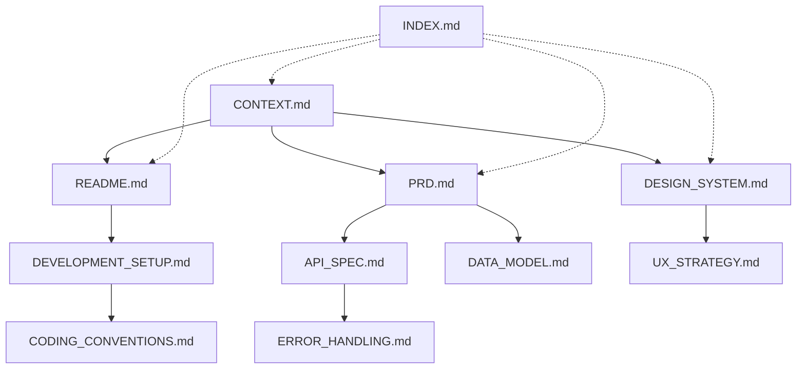

# Project Development Methodology

> **Version:** 1.0.0  
> **Last Updated:** 2025-11-24  
> **Purpose:** 프로젝트를 체계적으로 구성하고 실행하는 방법론 정의  
> **Scope:** 모든 신규 프로젝트 및 기능 개발에 적용

---

## 📋 목차

1. [개요](#개요)
2. [프로젝트 구성 원칙](#프로젝트-구성-원칙)
3. [문서 구조](#문서-구조)
4. [개발 프로세스](#개발-프로세스)
5. [Claude 활용 전략](#claude-활용-전략)
6. [품질 관리](#품질-관리)
7. [배포 및 운영](#배포-및-운영)

---

## 개요

### 방법론의 목적

이 방법론은 **Claude를 적극 활용하여 프로젝트를 체계적으로 구성하고 실행**하기 위한 표준 프로세스를 정의합니다.

### 핵심 원칙

1. **문서 우선 (Documentation First)**: 코드 작성 전 문서화
2. **단계적 접근 (Phased Approach)**: 명확한 단계 구분
3. **자동화 (Automation)**: 반복 작업의 자동화
4. **품질 보증 (Quality Assurance)**: 체계적인 검증
5. **지속적 개선 (Continuous Improvement)**: 회고 및 개선

---

## 프로젝트 구성 원칙

### 1. 프로젝트 시작 전 (Pre-Project)

#### 1.1 비즈니스 요구사항 정의
**문서:** `business/PRD.md` (Product Requirements Document)

**포함 내용:**
- 📊 **문제 정의**: 해결하려는 문제
- 🎯 **목표**: 측정 가능한 성공 지표
- 👥 **타겟 사용자**: 페르소나 정의
- 💡 **핵심 기능**: Must-have vs Nice-to-have
- 📈 **성공 지표**: KPI 정의
- ⏰ **타임라인**: 마일스톤 및 데드라인

**템플릿:**
```markdown
# [프로젝트명] PRD

## 1. Executive Summary
- 문제 정의
- 제안 솔루션
- 기대 효과

## 2. Background
- 현재 상황
- 문제점
- 기회

## 3. Goals & Success Metrics
- 비즈니스 목표
- 사용자 목표
- 측정 지표 (KPI)

## 4. User Personas
- Primary persona
- Secondary persona
- Edge cases

## 5. Features
### Must-Have (P0)
### Should-Have (P1)
### Nice-to-Have (P2)

## 6. Timeline
- Phase 1: MVP
- Phase 2: Beta
- Phase 3: Scale

## 7. Risks & Mitigation
```

#### 1.2 시스템 컨텍스트 정의
**문서:** `CONTEXT.md` (System Source of Truth)

**포함 내용:**
- 🎯 **System Intent**: Vision, Mission, Value Proposition
- 🚧 **Guardrails**: Business/Technical/Design Constraints
- 👥 **Target Personas**: 상세 페르소나
- 🛠️ **Technology Stack**: 기술 스택 선택 및 근거
- 📏 **System Boundaries**: In Scope / Out of Scope
- 📊 **Key Metrics**: 성공 지표 및 SLI/SLO
- 🗓️ **Development Phases**: 단계별 계획

**작성 시점:** 프로젝트 시작 시 (Day 1)  
**업데이트:** 주요 의사결정 시마다

#### 1.3 기술 스택 결정
**문서:** `specs/TECH_STACK.md`

**결정 기준:**
- ✅ 팀 역량
- ✅ 프로젝트 요구사항
- ✅ 확장성
- ✅ 커뮤니티 지원
- ✅ 비용

---

### 2. 프로젝트 초기 설정 (Project Setup)

#### 2.1 디렉토리 구조 생성

**표준 구조:**
```
project-name/
├── .agent/                    # Claude workflow 파일
│   └── workflows/
│       ├── dev-server.md
│       ├── create-page.md
│       ├── create-component.md
│       └── deploy.md
│
├── .claude/                   # Claude 설정
│   └── settings.local.json
│
├── business/                  # 비즈니스 문서
│   ├── PRD.md
│   └── BUSINESS_PLAN.md
│
├── specs/                     # 기술 명세서
│   ├── DESIGN_SYSTEM.md
│   ├── API_SPEC.md
│   ├── DATA_MODEL.md
│   └── ARCHITECTURE.md
│
├── guides/                    # 개발 가이드
│   ├── DEVELOPMENT_SETUP.md
│   ├── CODING_CONVENTIONS.md
│   ├── CODE_REVIEW_CHECKLIST.md
│   └── ERROR_HANDLING.md
│
├── scripts/                   # 자동화 스크립트
│   └── cleanup-git.sh
│
├── [frontend]/                # Frontend 코드
├── [backend]/                 # Backend 코드
│
├── CONTEXT.md                 # 시스템 컨텍스트
├── README.md                  # 프로젝트 개요
├── INDEX.md                   # 문서 인덱스
└── .gitignore                 # Git 제외 파일
```

#### 2.2 필수 문서 생성

**우선순위 순서:**
1. ✅ `CONTEXT.md` - 시스템 컨텍스트
2. ✅ `README.md` - 프로젝트 개요
3. ✅ `INDEX.md` - 문서 네비게이션
4. ✅ `.gitignore` - 보안 설정
5. ✅ `business/PRD.md` - 제품 요구사항
6. ✅ `specs/DESIGN_SYSTEM.md` - 디자인 시스템
7. ✅ `guides/DEVELOPMENT_SETUP.md` - 개발 환경 설정

#### 2.3 개발 환경 설정

**체크리스트:**
- [ ] Git 저장소 초기화
- [ ] `.gitignore` 생성
- [ ] 환경 변수 템플릿 (`.env.example`)
- [ ] 의존성 설치
- [ ] IDE 설정 (`.vscode/settings.json`)
- [ ] Pre-commit hooks (선택사항)

---

## 문서 구조

### 문서 계층



### 문서 유형별 가이드

#### 1. 전략 문서 (Strategic Documents)
- **CONTEXT.md**: 시스템의 단일 진실 공급원
- **PRD.md**: 제품 요구사항
- **BUSINESS_PLAN.md**: 비즈니스 계획

**특징:**
- 높은 수준의 의사결정
- 자주 변경되지 않음
- 모든 팀원이 읽어야 함

#### 2. 기술 명세서 (Technical Specifications)
- **API_SPEC.md**: API 엔드포인트 정의
- **DATA_MODEL.md**: 데이터베이스 스키마
- **ARCHITECTURE.md**: 시스템 아키텍처
- **DESIGN_SYSTEM.md**: 디자인 시스템

**특징:**
- 구현 전 작성
- 개발자 간 계약
- 버전 관리 필수

#### 3. 개발 가이드 (Development Guides)
- **DEVELOPMENT_SETUP.md**: 환경 설정
- **CODING_CONVENTIONS.md**: 코딩 규칙
- **CODE_REVIEW_CHECKLIST.md**: 리뷰 체크리스트
- **ERROR_HANDLING.md**: 에러 처리 패턴

**특징:**
- 실무 중심
- 예시 코드 포함
- 지속적 업데이트

#### 4. 운영 문서 (Operational Documents)
- **DEPLOYMENT.md**: 배포 절차
- **SECURITY_AUDIT.md**: 보안 감사
- **MONITORING.md**: 모니터링 가이드

**특징:**
- 체크리스트 형식
- 단계별 절차
- 문제 해결 가이드

---

## 개발 프로세스

### Phase 기반 개발

#### Phase 1: Planning (계획)

**목표:** 명확한 요구사항 정의 및 설계

**활동:**
1. **요구사항 수집**
   - 비즈니스 요구사항 분석
   - 사용자 스토리 작성
   - 우선순위 결정

2. **시스템 설계**
   - 아키텍처 설계
   - API 설계
   - 데이터베이스 스키마 설계
   - UI/UX 디자인

3. **문서 작성**
   - CONTEXT.md 업데이트
   - PRD.md 작성
   - 기술 명세서 작성

**산출물:**
- ✅ CONTEXT.md
- ✅ PRD.md
- ✅ API_SPEC.md
- ✅ DATA_MODEL.md
- ✅ DESIGN_SYSTEM.md
- ✅ Implementation Plan

**Claude 활용:**
```
CONTEXT.md와 PRD.md를 참고하여 
API_SPEC.md를 작성해주세요.

다음 요구사항을 포함해주세요:
- RESTful 규칙 준수
- 에러 응답 형식 통일
- 인증 방식 정의
```

#### Phase 2: Implementation (구현)

**목표:** 설계를 코드로 구현

**활동:**
1. **환경 설정**
   - 개발 환경 구축
   - 의존성 설치
   - 환경 변수 설정

2. **기능 구현**
   - TDD 방식 (선택사항)
   - 컴포넌트 단위 개발
   - API 엔드포인트 구현

3. **코드 리뷰**
   - PR 생성
   - 체크리스트 기반 리뷰
   - 피드백 반영

**산출물:**
- ✅ 작동하는 코드
- ✅ 테스트 코드
- ✅ 문서 업데이트

**Claude 활용:**
```
/create-component 워크플로우를 따라
UserProfileCard 컴포넌트를 생성해주세요.

요구사항:
- CODING_CONVENTIONS.md 준수
- TypeScript strict mode
- Design System 색상 사용
```

#### Phase 3: Verification (검증)

**목표:** 품질 보증 및 배포 준비

**활동:**
1. **테스트**
   - 단위 테스트
   - 통합 테스트
   - E2E 테스트

2. **성능 최적화**
   - Lighthouse 점수 확인
   - 번들 크기 최적화
   - 이미지 최적화

3. **보안 검토**
   - 환경 변수 확인
   - 에러 처리 확인
   - 접근 권한 확인

**산출물:**
- ✅ 테스트 리포트
- ✅ 성능 벤치마크
- ✅ 보안 체크리스트
- ✅ Walkthrough 문서

**Claude 활용:**
```
CODE_REVIEW_CHECKLIST.md를 참고하여
현재 PR을 검토해주세요.

특히 다음 항목을 확인해주세요:
- TypeScript 타입 안정성
- 에러 처리
- 성능 최적화
- 보안
```

---

## Claude 활용 전략

### 1. Workflow 기반 자동화

**Workflow 파일 위치:** `.agent/workflows/`

**표준 Workflow:**
1. **dev-server.md** - 개발 서버 시작
2. **create-page.md** - 새 페이지 생성
3. **create-component.md** - 컴포넌트 생성
4. **create-api-endpoint.md** - API 엔드포인트 추가
5. **deploy.md** - 배포 준비

**사용 예시:**
```bash
# Claude에게 요청
/dev-server

# 또는
/create-page 워크플로우를 따라 /admin 페이지를 생성해주세요
```

### 2. 컨텍스트 제공 전략

**효과적인 프롬프트:**
```
[문서 참조] + [명확한 요구사항] + [제약사항]

예시:
CONTEXT.md와 API_SPEC.md를 참고하여
프로 프로필 조회 API를 구현해주세요.

요구사항:
- GET /api/profiles/:slug
- ERROR_HANDLING.md의 패턴 적용
- TypeScript strict mode 준수
```

**비효과적인 프롬프트:**
```
❌ "프로필 API 만들어줘"
❌ "코드 작성해줘"
```

### 3. 단계별 검증

**각 단계마다 Claude에게 검증 요청:**
```
1단계: 컴포넌트 생성
2단계: TypeScript 타입 체크 (npx tsc --noEmit)
3단계: Lint 검사 (npm run lint)
4단계: 브라우저에서 확인
```

### 4. 문서 기반 개발

**문서 우선 접근:**
1. 문서 작성 (CONTEXT.md, API_SPEC.md 등)
2. Claude에게 문서 기반 코드 생성 요청
3. 검증 및 피드백
4. 문서 업데이트

---

## 품질 관리

### 1. 코드 품질

**체크리스트:**
- [ ] TypeScript strict mode 준수
- [ ] ESLint 통과
- [ ] Prettier 포맷팅
- [ ] 코딩 컨벤션 준수
- [ ] 주석 및 문서화

**자동화:**
```json
// package.json
{
  "scripts": {
    "lint": "eslint . --ext .ts,.tsx",
    "format": "prettier --write .",
    "type-check": "tsc --noEmit"
  }
}
```

### 2. 테스트

**테스트 피라미드:**
```
      E2E Tests (10%)
    ─────────────────
   Integration Tests (30%)
  ─────────────────────────
 Unit Tests (60%)
─────────────────────────────
```

**커버리지 목표:**
- Unit Tests: 80%+
- Integration Tests: 60%+
- E2E Tests: Critical flows

### 3. 성능

**목표 지표:**
- LCP (Largest Contentful Paint): < 2.5s
- FID (First Input Delay): < 100ms
- CLS (Cumulative Layout Shift): < 0.1
- Lighthouse Score: > 90

### 4. 보안

**필수 체크:**
- [ ] 환경 변수 보호
- [ ] Private key 보호
- [ ] SQL Injection 방지
- [ ] XSS 방지
- [ ] CSRF 방지

---

## 배포 및 운영

### 1. 배포 프로세스

**단계:**
1. **Pre-deployment**
   - 빌드 테스트
   - 타입 체크
   - Lint 검사
   - 환경 변수 확인

2. **Deployment**
   - Staging 배포
   - Smoke test
   - Production 배포

3. **Post-deployment**
   - 모니터링
   - 에러 추적
   - 성능 확인

**Workflow:** `/deploy` 워크플로우 사용

### 2. 모니터링

**도구:**
- **에러 추적:** Sentry
- **분석:** Google Analytics, Mixpanel
- **성능:** Vercel Analytics, Lighthouse
- **Uptime:** UptimeRobot

### 3. 롤백 계획

**롤백 시나리오:**
- Critical bug 발견
- 성능 저하
- 보안 이슈

**롤백 절차:**
1. 이전 버전으로 즉시 롤백
2. 문제 분석
3. 수정 및 재배포

---

## 프로젝트 템플릿

### 신규 프로젝트 시작 체크리스트

```markdown
# 프로젝트 시작 체크리스트

## Phase 0: 준비 (Day 1)
- [ ] Git 저장소 생성
- [ ] 디렉토리 구조 생성
- [ ] .gitignore 생성
- [ ] README.md 작성
- [ ] CONTEXT.md 작성

## Phase 1: 문서화 (Week 1)
- [ ] PRD.md 작성
- [ ] DESIGN_SYSTEM.md 작성
- [ ] API_SPEC.md 작성
- [ ] DATA_MODEL.md 작성
- [ ] DEVELOPMENT_SETUP.md 작성

## Phase 2: 환경 설정 (Week 1)
- [ ] Frontend 프로젝트 초기화
- [ ] Backend 프로젝트 초기화
- [ ] 환경 변수 템플릿 생성
- [ ] 의존성 설치
- [ ] 개발 서버 실행 확인

## Phase 3: Workflow 설정 (Week 1)
- [ ] .agent/workflows/ 생성
- [ ] dev-server.md 작성
- [ ] create-page.md 작성
- [ ] create-component.md 작성
- [ ] create-api-endpoint.md 작성

## Phase 4: 코딩 가이드 (Week 1)
- [ ] CODING_CONVENTIONS.md 작성
- [ ] CODE_REVIEW_CHECKLIST.md 작성
- [ ] ERROR_HANDLING.md 작성

## Phase 5: 보안 설정 (Week 1)
- [ ] .gitignore 검증
- [ ] 환경 변수 보호 확인
- [ ] SECURITY_AUDIT.md 작성
```

---

## 부록

### A. 문서 템플릿

#### CONTEXT.md 템플릿
```markdown
# CONTEXT.md
## [프로젝트명] System Context & Source of Truth

> **Last Updated:** YYYY-MM-DD
> **Version:** 1.0.0
> **Status:** Active

## 1. System Intent
### Vision
### Mission
### Core Value Proposition

## 2. Guardrails
### Business Constraints
### Technical Constraints
### Design Principles

## 3. Target Personas
### Primary Persona
### Secondary Persona

## 4. Technology Stack
### Frontend
### Backend
### Infrastructure

## 5. System Boundaries
### In Scope
### Out of Scope

## 6. Key Metrics
### Business KPIs
### Technical SLIs

## 7. Development Phases
### Phase 1: MVP
### Phase 2: Beta
### Phase 3: Scale
```

### B. Workflow 템플릿

```markdown
---
description: [간단한 설명]
---

# [Workflow 이름]

[상세 설명]

## 1. [단계 1]
// turbo (자동 실행 가능한 경우)
```bash
[명령어]
```

## 2. [단계 2]
[설명]

## 체크리스트
- [ ] [항목 1]
- [ ] [항목 2]
```

### C. 참고 자료

**내부 문서:**
- [CONTEXT.md](../CONTEXT.md)
- [INDEX.md](../INDEX.md)
- [CODING_CONVENTIONS.md](./CODING_CONVENTIONS.md)

**외부 자료:**
- [Semantic Versioning](https://semver.org/)
- [Conventional Commits](https://www.conventionalcommits.org/)
- [Keep a Changelog](https://keepachangelog.com/)

---

**이 방법론은 프로젝트 경험을 바탕으로 지속적으로 개선됩니다.**
