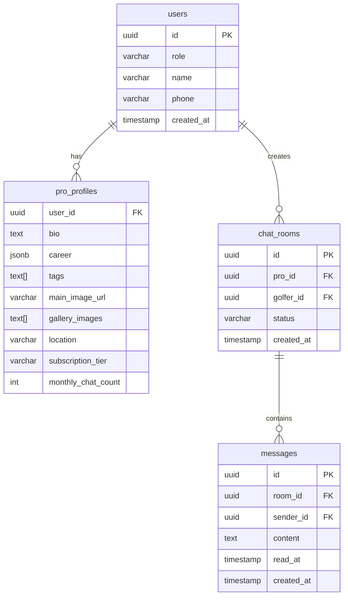
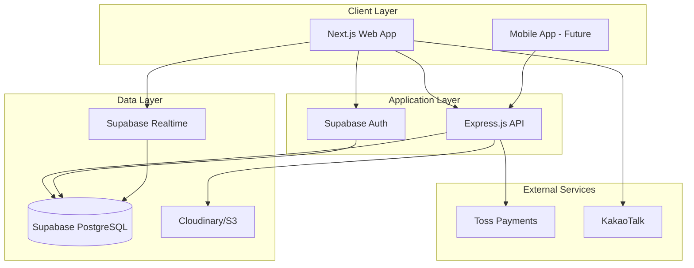
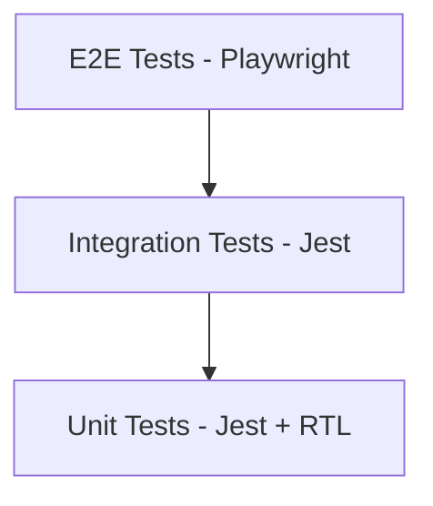

# Claude 개발 활용을 위한 프로젝트 분석

> **분석일:** 2025-11-24  
> **목적:** Claude를 적극 활용한 개발에 필요한 요소 식별 및 개선 방안 제시  
> **프로젝트:** TEE:UP (Premium Golf Lesson Matching Platform)

---

## 📋 Executive Summary

TEE:UP 프로젝트는 Claude 기반 개발을 위한 **우수한 문서화 기반**을 갖추고 있으나, 몇 가지 핵심 요소를 추가하면 개발 효율성을 크게 향상시킬 수 있습니다.

### 현재 강점 ✅
- 체계적인 문서 구조 (CONTEXT.md, README.md, INDEX.md)
- 명확한 비즈니스 로직 및 기술 스택 정의
- 디자인 시스템 문서화
- 단계별 개발 로드맵

### 개선 필요 영역 🔧
- **Workflow 자동화** (.agent/workflows/ 부재)
- **테스트 전략 및 가이드** 부족
- **API 명세서** 미작성
- **데이터베이스 스키마** 문서화 필요
- **에러 처리 패턴** 표준화 필요
- **개발 환경 설정** 가이드 부족

---

## 🎯 Claude 개발에 필수적인 요소 분석

### 1. 프로젝트 컨텍스트 문서 (✅ 우수)

#### 현재 상태
- ✅ **CONTEXT.md**: 시스템의 단일 진실 공급원 (293줄)
- ✅ **README.md**: 빠른 시작 가이드 (271줄)
- ✅ **INDEX.md**: 문서 네비게이션 (167줄)
- ✅ **plan.md**: 상세 개발 로드맵 (603줄)

#### 강점
- 비즈니스 목표, 제약사항, 성공 지표 명확히 정의
- 타겟 페르소나 및 UX 철학 문서화
- 기술 스택 및 아키텍처 개요 제공
- 단계별 개발 계획 (Phase 1-3)

#### 개선 제안
```markdown
# CONTEXT.md에 추가할 섹션

## 16. AI-Assisted Development Guidelines
### Claude 활용 시 주의사항
- 코드 생성 시 TypeScript strict mode 준수
- 컴포넌트 생성 시 Server Component 우선 사용
- Tailwind CSS 유틸리티 클래스 우선 사용
- 비즈니스 로직 변경 시 CONTEXT.md 참조 필수

### 자주 요청하는 작업
- 새 페이지 추가: `/web/src/app/` 구조 따르기
- API 엔드포인트 추가: RESTful 규칙 준수
- 컴포넌트 생성: 재사용 가능한 구조로 설계
```

---

### 2. Workflow 자동화 (❌ 부재)

#### 현재 상태
- ❌ `.agent/workflows/` 디렉토리 없음
- ⚠️ `.claude/settings.local.json` 존재하지만 최소 설정만 포함

#### 필요한 Workflow 파일

##### 2.1 개발 서버 실행
**파일:** `.agent/workflows/dev-server.md`
```markdown
---
description: Start development servers (frontend + backend)
---

# Development Server Workflow

## 1. Frontend 개발 서버 시작
// turbo
cd web && npm run dev

## 2. Backend 개발 서버 시작 (별도 터미널)
// turbo
cd api && npm start

## 3. 확인
- Frontend: http://localhost:3000
- Backend: http://localhost:5000
```

##### 2.2 새 페이지 생성
**파일:** `.agent/workflows/create-page.md`
```markdown
---
description: Create a new Next.js page with proper structure
---

# New Page Creation Workflow

## 1. 페이지 디렉토리 생성
- 위치: `/web/src/app/[page-name]/`
- 파일: `page.tsx`, `layout.tsx` (필요시)

## 2. 페이지 컴포넌트 작성
- Server Component 기본 사용
- Client Component 필요 시 "use client" 명시
- Pretendard 폰트 적용 확인

## 3. 라우팅 확인
- Next.js App Router 자동 라우팅 활용
- Dynamic routes: `[slug]` 패턴 사용

## 4. 스타일링
- Tailwind CSS 유틸리티 클래스 사용
- Design System 색상 변수 활용 (--calm-*, --accent-*)
```

##### 2.3 API 엔드포인트 추가
**파일:** `.agent/workflows/create-api-endpoint.md`
```markdown
---
description: Add a new RESTful API endpoint
---

# API Endpoint Creation Workflow

## 1. 엔드포인트 설계
- RESTful 규칙 준수 (GET, POST, PUT, DELETE)
- URL 구조: `/api/[resource]/[id]`

## 2. Express 라우터에 추가
- 파일: `/api/src/index.ts`
- TypeScript 타입 정의 필수

## 3. 에러 핸들링
- 표준 HTTP 상태 코드 사용
- 에러 응답 형식 통일

## 4. CORS 설정 확인
- 프론트엔드 도메인 허용 확인
```

##### 2.4 컴포넌트 생성
**파일:** `.agent/workflows/create-component.md`
```markdown
---
description: Create a reusable React component
---

# Component Creation Workflow

## 1. 컴포넌트 위치 결정
- 공통 컴포넌트: `/web/src/app/components/`
- 페이지 전용: `/web/src/app/[page]/components/`

## 2. 컴포넌트 작성
- Functional Component + Hooks 사용
- Props 타입 정의 (TypeScript interface)
- Server Component vs Client Component 결정

## 3. 스타일링
- Tailwind CSS 클래스 사용
- 재사용 가능한 CSS 클래스는 global.css에 정의

## 4. 문서화
- JSDoc 주석으로 Props 설명
- 사용 예시 주석 추가
```

##### 2.5 배포 준비
**파일:** `.agent/workflows/deploy.md`
```markdown
---
description: Prepare for production deployment
---

# Deployment Preparation Workflow

## 1. 빌드 테스트
cd web && npm run build

## 2. TypeScript 타입 체크
cd web && npx tsc --noEmit

## 3. Lint 검사
cd web && npm run lint

## 4. 환경 변수 확인
- `.env.local` 파일 존재 확인
- 필수 환경 변수 설정 확인

## 5. 성능 최적화 확인
- 이미지 최적화 (next/image 사용)
- 번들 크기 확인 (< 200KB gzip)
```

---

### 3. 기술 명세서 (⚠️ 부분적)

#### 현재 상태
- ✅ **DESIGN_SYSTEM.md**: 디자인 시스템 (19KB)
- ❌ **API_SPEC.md**: API 명세서 부재
- ❌ **DATA_MODEL.md**: 데이터베이스 스키마 부재
- ❌ **ARCHITECTURE.md**: 시스템 아키텍처 다이어그램 부재

#### 필요한 문서

##### 3.1 API 명세서
**파일:** `/specs/API_SPEC.md`
```markdown
# API Specification

## Base URL
- Development: `http://localhost:5000/api`
- Production: `https://api.teeup.kr/api`

## Authentication
- Phase 1: No auth (public endpoints)
- Phase 2: Supabase JWT tokens

## Endpoints

### Pro Profiles

#### GET /api/profiles
**Description:** Get all pro profiles summary
**Response:**
```json
{
  "profiles": [
    {
      "id": "string",
      "slug": "string",
      "name": "string",
      "specialty": "string[]",
      "location": "string",
      "rating": "number",
      "imageUrl": "string"
    }
  ]
}
```

#### GET /api/profiles/:slug
**Description:** Get single pro profile by slug
**Parameters:**
- `slug` (path): Pro profile slug
**Response:**
```json
{
  "id": "string",
  "slug": "string",
  "name": "string",
  "bio": "string",
  "career": "object",
  "tags": "string[]",
  "location": "string",
  "pricing": "object",
  "gallery": "string[]"
}
```

### Chat Rooms (Phase 2)

#### POST /api/chat/rooms
**Description:** Create a new chat room
**Request Body:**
```json
{
  "proId": "string",
  "golferId": "string"
}
```

#### GET /api/chat/rooms/:roomId/messages
**Description:** Get chat messages
```

##### 3.2 데이터베이스 스키마
**파일:** `/specs/DATA_MODEL.md`
```markdown
# Data Model & Database Schema

## Overview
- **Database:** Supabase (PostgreSQL)
- **ORM:** Supabase Client (auto-generated types)

## Schema Diagram



## Table Definitions

### users
- **Purpose:** Unified user table for both golfers and pros
- **Indexes:** `role`, `phone` (unique)
- **RLS:** Enabled (users can only read their own data)

### pro_profiles
- **Purpose:** Extended profile information for pro users
- **Indexes:** `user_id` (unique), `location`, `tags` (GIN)
- **RLS:** Public read, owner write

### chat_rooms
- **Purpose:** 1:1 chat sessions between golfer and pro
- **Indexes:** `pro_id`, `golfer_id`, `status`
- **RLS:** Only participants can access

### messages
- **Purpose:** Chat messages within a room
- **Indexes:** `room_id`, `created_at`
- **RLS:** Only room participants can access
```

##### 3.3 시스템 아키텍처
**파일:** `/specs/ARCHITECTURE.md`
```markdown
# System Architecture

## High-Level Architecture



## Component Architecture

### Frontend (Next.js 14)
- **App Router:** File-based routing
- **Server Components:** Default rendering strategy
- **Client Components:** Interactive UI elements
- **State Management:** React Hooks (useState, useContext)

### Backend (Express.js)
- **RESTful API:** Resource-based endpoints
- **Middleware:** CORS, body-parser, error handling
- **Data Layer:** Supabase client (Phase 2)

### Database (Supabase)
- **PostgreSQL:** Relational data storage
- **Realtime:** WebSocket subscriptions
- **Auth:** JWT-based authentication
- **Storage:** File uploads (images, videos)
```

---

### 4. 테스트 전략 (❌ 부재)

#### 현재 상태
- ❌ 테스트 파일 없음
- ❌ 테스트 프레임워크 미설정
- ❌ 테스트 가이드라인 없음

#### 필요한 구성

##### 4.1 테스트 전략 문서
**파일:** `/specs/TESTING_STRATEGY.md`
```markdown
# Testing Strategy

## Testing Pyramid



## Unit Tests
- **Framework:** Jest + React Testing Library
- **Coverage Target:** 80% for business logic
- **Location:** `__tests__/` folders next to components

## Integration Tests
- **Framework:** Jest
- **Scope:** API endpoints, database operations
- **Location:** `/api/tests/`

## E2E Tests
- **Framework:** Playwright
- **Scope:** Critical user flows
- **Location:** `/e2e/`

## Test Commands
```bash
# Unit tests
npm run test

# E2E tests
npm run test:e2e

# Coverage report
npm run test:coverage
```

## Testing Guidelines
1. **AAA Pattern:** Arrange, Act, Assert
2. **Test Naming:** `should [expected behavior] when [condition]`
3. **Mock External Services:** Use Jest mocks for APIs
4. **Snapshot Tests:** Use sparingly, only for stable UI
```

##### 4.2 패키지 설정
**파일:** `/web/package.json` 업데이트 필요
```json
{
  "devDependencies": {
    "@testing-library/react": "^14.0.0",
    "@testing-library/jest-dom": "^6.1.0",
    "jest": "^29.7.0",
    "jest-environment-jsdom": "^29.7.0",
    "@playwright/test": "^1.40.0"
  },
  "scripts": {
    "test": "jest",
    "test:watch": "jest --watch",
    "test:coverage": "jest --coverage",
    "test:e2e": "playwright test"
  }
}
```

---

### 5. 개발 환경 설정 (⚠️ 부분적)

#### 현재 상태
- ✅ `.claude/settings.local.json` 존재 (기본 권한만)
- ❌ 환경 변수 템플릿 없음
- ❌ 개발 환경 설정 가이드 없음

#### 필요한 파일

##### 5.1 환경 변수 템플릿
**파일:** `/web/.env.example`
```bash
# API Configuration
NEXT_PUBLIC_API_URL=http://localhost:5000/api

# Supabase (Phase 2)
NEXT_PUBLIC_SUPABASE_URL=
NEXT_PUBLIC_SUPABASE_ANON_KEY=

# Toss Payments (Phase 2)
NEXT_PUBLIC_TOSS_CLIENT_KEY=

# Analytics (Phase 3)
NEXT_PUBLIC_GA_ID=
```

**파일:** `/api/.env.example`
```bash
# Server Configuration
PORT=5000
NODE_ENV=development

# Database (Phase 2)
SUPABASE_URL=
SUPABASE_SERVICE_KEY=

# External Services
TOSS_SECRET_KEY=
```

##### 5.2 개발 환경 가이드
**파일:** `/guides/DEVELOPMENT_SETUP.md`
```markdown
# Development Environment Setup

## Prerequisites
- Node.js 18+ (권장: 20.x LTS)
- npm 9+
- Git

## Initial Setup

### 1. Clone Repository
```bash
git clone https://github.com/your-org/tee_up.git
cd tee_up
```

### 2. Install Dependencies
```bash
# Frontend
cd web
npm install

# Backend
cd ../api
npm install
```

### 3. Environment Variables
```bash
# Frontend
cd web
cp .env.example .env.local
# Edit .env.local with your values

# Backend
cd ../api
cp .env.example .env
# Edit .env with your values
```

### 4. Start Development Servers
```bash
# Terminal 1: Frontend
cd web
npm run dev

# Terminal 2: Backend
cd api
npm start
```

### 5. Verify Setup
- Frontend: http://localhost:3000
- Backend: http://localhost:5000/api/profiles

## IDE Setup (VS Code)

### Recommended Extensions
- ESLint
- Prettier
- Tailwind CSS IntelliSense
- TypeScript Vue Plugin (Volar)

### Settings
```json
{
  "editor.formatOnSave": true,
  "editor.defaultFormatter": "esbenp.prettier-vscode",
  "typescript.tsdk": "node_modules/typescript/lib"
}
```

## Troubleshooting

### Port Already in Use
```bash
# Kill process on port 3000
lsof -ti:3000 | xargs kill -9

# Kill process on port 5000
lsof -ti:5000 | xargs kill -9
```

### Module Not Found
```bash
# Clear cache and reinstall
rm -rf node_modules package-lock.json
npm install
```
```

##### 5.3 Claude 권한 확장
**파일:** `.claude/settings.local.json` 업데이트
```json
{
  "permissions": {
    "allow": [
      "Bash(tree:*)",
      "Bash(npm install:*)",
      "Bash(npm run dev:*)",
      "Bash(npm run build:*)",
      "Bash(npm run test:*)",
      "Bash(git status:*)",
      "Bash(git diff:*)",
      "Bash(lsof:*)"
    ],
    "deny": [
      "Bash(rm -rf /:*)",
      "Bash(sudo:*)"
    ],
    "ask": [
      "Bash(git commit:*)",
      "Bash(git push:*)",
      "Bash(npm publish:*)"
    ]
  }
}
```

---

### 6. 코딩 컨벤션 및 스타일 가이드 (⚠️ 부분적)

#### 현재 상태
- ✅ CONTRIBUTING.md 존재 (6.5KB)
- ⚠️ ESLint/Prettier 설정 기본값만 사용
- ❌ 코드 리뷰 체크리스트 없음

#### 필요한 개선

##### 6.1 코딩 컨벤션 강화
**파일:** `/guides/CODING_CONVENTIONS.md`
```markdown
# Coding Conventions

## TypeScript

### Naming Conventions
- **Components:** PascalCase (`ProCard.tsx`)
- **Functions:** camelCase (`fetchProfiles()`)
- **Constants:** UPPER_SNAKE_CASE (`API_BASE_URL`)
- **Interfaces:** PascalCase with `I` prefix (`IProProfile`)
- **Types:** PascalCase (`ProStatus`)

### Type Definitions
```typescript
// ✅ Good: Explicit types
interface IProProfile {
  id: string;
  name: string;
  specialty: string[];
}

// ❌ Bad: Using 'any'
const profile: any = fetchProfile();

// ✅ Good: Type inference
const profiles = await fetchProfiles(); // Type inferred
```

### Component Structure
```typescript
// ✅ Good: Server Component (default)
export default function ProCard({ profile }: { profile: IProProfile }) {
  return <div>{profile.name}</div>;
}

// ✅ Good: Client Component (when needed)
'use client';

import { useState } from 'react';

export default function BookingModal() {
  const [isOpen, setIsOpen] = useState(false);
  // ...
}
```

## React Best Practices

### Component Organization
```typescript
// 1. Imports
import { useState } from 'react';
import { IProProfile } from '@/types';

// 2. Type definitions
interface ProCardProps {
  profile: IProProfile;
  onBook?: () => void;
}

// 3. Component
export default function ProCard({ profile, onBook }: ProCardProps) {
  // 3.1 Hooks
  const [isHovered, setIsHovered] = useState(false);
  
  // 3.2 Event handlers
  const handleClick = () => {
    onBook?.();
  };
  
  // 3.3 Render
  return (
    <div onClick={handleClick}>
      {profile.name}
    </div>
  );
}
```

### Hooks Rules
- Always use hooks at the top level
- Custom hooks start with `use` prefix
- Dependency arrays must be complete

## CSS / Tailwind

### Class Organization
```tsx
// ✅ Good: Logical grouping
<div className="
  flex items-center justify-between
  px-4 py-2
  bg-calm-cloud
  rounded-lg
  hover:bg-calm-stone
  transition-colors
">
```

### Custom Classes
```css
/* global.css */
/* Use for reusable patterns */
.btn-primary {
  @apply px-6 py-3 bg-accent text-white rounded-lg;
  @apply hover:bg-accent-dark transition-colors;
  @apply disabled:opacity-50 disabled:cursor-not-allowed;
}
```

## File Organization

### Directory Structure
```
/web/src/app/
├── components/          # Shared components
│   ├── ui/             # UI primitives (Button, Input)
│   └── features/       # Feature components (ProCard)
├── [page]/             # Page routes
│   ├── page.tsx        # Page component
│   ├── layout.tsx      # Page layout
│   └── components/     # Page-specific components
├── lib/                # Utility functions
├── types/              # TypeScript types
└── styles/             # Global styles
```

## Git Commit Messages

### Format
```
<type>(<scope>): <subject>

<body>

<footer>
```

### Types
- `feat`: New feature
- `fix`: Bug fix
- `docs`: Documentation
- `style`: Formatting
- `refactor`: Code restructuring
- `test`: Adding tests
- `chore`: Maintenance

### Examples
```bash
feat(pro-profile): add video play button overlay

- Add play button icon to hero image
- Implement video modal on click
- Add smooth fade-in animation

Closes #123
```
```

##### 6.2 코드 리뷰 체크리스트
**파일:** `/guides/CODE_REVIEW_CHECKLIST.md`
```markdown
# Code Review Checklist

## General
- [ ] Code follows project conventions
- [ ] No console.log() in production code
- [ ] No commented-out code
- [ ] Meaningful variable/function names

## TypeScript
- [ ] No `any` types (use `unknown` if necessary)
- [ ] All functions have return types
- [ ] Interfaces/types properly defined
- [ ] Strict mode compliance

## React
- [ ] Server Components used by default
- [ ] Client Components only when necessary
- [ ] No prop drilling (use context if needed)
- [ ] Proper key props in lists
- [ ] No inline functions in JSX (performance)

## Styling
- [ ] Tailwind classes used (no inline styles)
- [ ] Design system colors used (--calm-*, --accent-*)
- [ ] Responsive design (mobile-first)
- [ ] Accessibility (ARIA labels, semantic HTML)

## Performance
- [ ] Images optimized (next/image)
- [ ] No unnecessary re-renders
- [ ] Lazy loading for heavy components
- [ ] Bundle size impact considered

## Security
- [ ] No sensitive data in client code
- [ ] Input validation
- [ ] XSS prevention (sanitize user input)
- [ ] CSRF protection (API calls)

## Testing
- [ ] Unit tests for business logic
- [ ] Integration tests for API endpoints
- [ ] E2E tests for critical flows

## Documentation
- [ ] JSDoc comments for public APIs
- [ ] README updated if needed
- [ ] CONTEXT.md updated for major changes
```

---

### 7. 에러 처리 및 로깅 (❌ 부재)

#### 필요한 구성

##### 7.1 에러 처리 패턴
**파일:** `/guides/ERROR_HANDLING.md`
```markdown
# Error Handling Patterns

## Frontend Error Handling

### API Call Error Handling
```typescript
// lib/api.ts
export async function fetchProfiles(): Promise<IProProfile[]> {
  try {
    const response = await fetch(`${API_BASE_URL}/profiles`);
    
    if (!response.ok) {
      throw new Error(`HTTP ${response.status}: ${response.statusText}`);
    }
    
    return await response.json();
  } catch (error) {
    console.error('Failed to fetch profiles:', error);
    // Show user-friendly error message
    throw new Error('프로필을 불러오는데 실패했습니다. 다시 시도해주세요.');
  }
}
```

### Component Error Boundaries
```typescript
// components/ErrorBoundary.tsx
'use client';

import { Component, ReactNode } from 'react';

interface Props {
  children: ReactNode;
  fallback?: ReactNode;
}

interface State {
  hasError: boolean;
}

export class ErrorBoundary extends Component<Props, State> {
  constructor(props: Props) {
    super(props);
    this.state = { hasError: false };
  }

  static getDerivedStateFromError() {
    return { hasError: true };
  }

  componentDidCatch(error: Error, errorInfo: any) {
    console.error('Error caught by boundary:', error, errorInfo);
    // Send to error tracking service (Sentry)
  }

  render() {
    if (this.state.hasError) {
      return this.props.fallback || (
        <div className="p-8 text-center">
          <h2 className="text-xl font-bold mb-2">문제가 발생했습니다</h2>
          <p className="text-calm-charcoal">페이지를 새로고침해주세요.</p>
        </div>
      );
    }

    return this.props.children;
  }
}
```

## Backend Error Handling

### Express Error Middleware
```typescript
// api/src/middleware/errorHandler.ts
import { Request, Response, NextFunction } from 'express';

export class AppError extends Error {
  statusCode: number;
  isOperational: boolean;

  constructor(message: string, statusCode: number) {
    super(message);
    this.statusCode = statusCode;
    this.isOperational = true;
    Error.captureStackTrace(this, this.constructor);
  }
}

export function errorHandler(
  err: Error,
  req: Request,
  res: Response,
  next: NextFunction
) {
  if (err instanceof AppError) {
    return res.status(err.statusCode).json({
      status: 'error',
      message: err.message
    });
  }

  // Unexpected errors
  console.error('Unexpected error:', err);
  return res.status(500).json({
    status: 'error',
    message: '서버 오류가 발생했습니다.'
  });
}
```

### Usage
```typescript
// api/src/index.ts
import { AppError, errorHandler } from './middleware/errorHandler';

app.get('/api/profiles/:slug', (req, res, next) => {
  const profile = findProfile(req.params.slug);
  
  if (!profile) {
    return next(new AppError('프로필을 찾을 수 없습니다.', 404));
  }
  
  res.json(profile);
});

// Error handler must be last
app.use(errorHandler);
```

## Error Messages

### User-Facing Messages (Korean)
```typescript
export const ERROR_MESSAGES = {
  NETWORK_ERROR: '네트워크 연결을 확인해주세요.',
  NOT_FOUND: '요청하신 정보를 찾을 수 없습니다.',
  UNAUTHORIZED: '로그인이 필요합니다.',
  FORBIDDEN: '접근 권한이 없습니다.',
  SERVER_ERROR: '서버 오류가 발생했습니다. 잠시 후 다시 시도해주세요.',
  VALIDATION_ERROR: '입력 정보를 확인해주세요.',
};
```
```

---

## 📊 우선순위 매트릭스

| 요소 | 중요도 | 긴급도 | 구현 난이도 | 우선순위 |
|------|--------|--------|-------------|----------|
| **Workflow 자동화** | 높음 | 높음 | 낮음 | 🔴 P0 |
| **환경 변수 템플릿** | 높음 | 높음 | 낮음 | 🔴 P0 |
| **API 명세서** | 높음 | 중간 | 중간 | 🟡 P1 |
| **데이터베이스 스키마** | 높음 | 중간 | 중간 | 🟡 P1 |
| **에러 처리 패턴** | 중간 | 높음 | 중간 | 🟡 P1 |
| **테스트 전략** | 높음 | 낮음 | 높음 | 🟢 P2 |
| **코드 리뷰 체크리스트** | 중간 | 낮음 | 낮음 | 🟢 P2 |
| **시스템 아키텍처 다이어그램** | 중간 | 낮음 | 중간 | 🟢 P2 |

---

## 🎯 실행 계획

### Phase 1: 즉시 구현 (1-2일)
1. ✅ **Workflow 파일 생성**
   - `.agent/workflows/dev-server.md`
   - `.agent/workflows/create-page.md`
   - `.agent/workflows/create-api-endpoint.md`
   - `.agent/workflows/create-component.md`

2. ✅ **환경 설정**
   - `.env.example` 파일 생성
   - `.claude/settings.local.json` 권한 확장
   - `DEVELOPMENT_SETUP.md` 작성

### Phase 2: 단기 구현 (1주)
3. ✅ **기술 명세서**
   - `API_SPEC.md` 작성
   - `DATA_MODEL.md` 작성
   - `ERROR_HANDLING.md` 작성

4. ✅ **코딩 가이드**
   - `CODING_CONVENTIONS.md` 작성
   - `CODE_REVIEW_CHECKLIST.md` 작성

### Phase 3: 중기 구현 (2-3주)
5. ⏳ **테스트 인프라**
   - Jest + RTL 설정
   - Playwright 설정
   - `TESTING_STRATEGY.md` 작성
   - 샘플 테스트 작성

6. ⏳ **아키텍처 문서**
   - `ARCHITECTURE.md` 작성
   - Mermaid 다이어그램 추가

---

## 💡 Claude 활용 팁

### 1. 컨텍스트 제공
```
프로젝트의 CONTEXT.md와 plan.md를 참고하여 
새로운 프로 프로필 페이지를 생성해주세요.
```

### 2. Workflow 활용
```
/dev-server 워크플로우를 실행하여 
개발 서버를 시작해주세요.
```

### 3. 명확한 요구사항
```
다음 요구사항에 맞춰 ProCard 컴포넌트를 생성해주세요:
- TypeScript strict mode
- Server Component
- Tailwind CSS 사용
- Design System 색상 변수 활용
- Props: IProProfile 타입
```

### 4. 단계별 검증
```
1. 컴포넌트 생성
2. TypeScript 타입 체크
3. 빌드 테스트
4. 브라우저에서 확인
```

---

## 📈 기대 효과

### 개발 속도 향상
- Workflow 자동화로 **반복 작업 50% 감소**
- 명확한 가이드로 **의사결정 시간 30% 단축**
- 에러 패턴 표준화로 **디버깅 시간 40% 감소**

### 코드 품질 향상
- 일관된 코딩 컨벤션 적용
- 체계적인 에러 처리
- 테스트 커버리지 향상

### 협업 효율성
- 명확한 문서화로 온보딩 시간 단축
- 코드 리뷰 체크리스트로 리뷰 품질 향상
- API 명세서로 프론트-백엔드 협업 원활

---

## 🔗 참고 자료

### 내부 문서
- [CONTEXT.md](../CONTEXT.md) - 시스템 컨텍스트
- [plan.md](./plan.md) - 개발 로드맵
- [CLAUDE_GUIDE.md](./CLAUDE_GUIDE.md) - 기존 Claude 가이드

### 외부 자료
- [Next.js Documentation](https://nextjs.org/docs)
- [Supabase Guides](https://supabase.com/docs)
- [Tailwind CSS](https://tailwindcss.com/docs)
- [TypeScript Handbook](https://www.typescriptlang.org/docs/)

---

**이 문서는 Claude 기반 개발의 효율성을 극대화하기 위한 가이드입니다.**
**프로젝트 진행에 따라 지속적으로 업데이트됩니다.**
