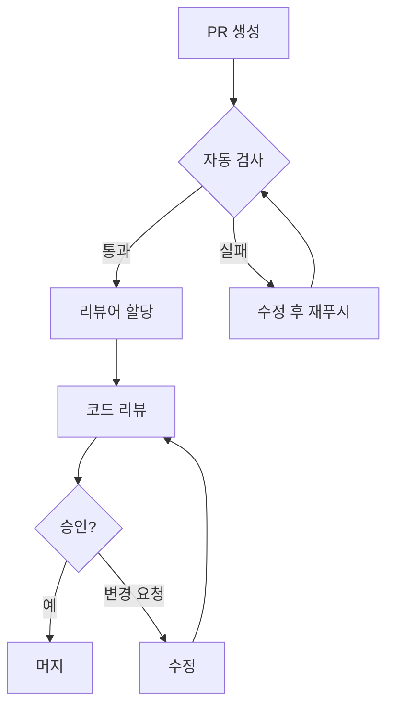

# CODE_REVIEW_GUIDE.md

## 코드 리뷰 가이드

> **본 문서는 효과적인 코드 리뷰를 위한 체크리스트와 가이드라인을 제공합니다.**

---

## 변경 이력 (Changelog)

| 버전 | 날짜 | 작성자 | 변경 내용 |
|------|------|--------|----------|
| 1.0.0 | 2025-11-25 | @tech-lead | 최초 작성 |

## 관련 문서 (Related Documents)

- [CONTRIBUTING.md](CONTRIBUTING.md) — 기여 가이드
- [CLEAN_CODE_GUIDE.md](CLEAN_CODE_GUIDE.md) — 클린 코드 가이드
- [TEST_STRATEGY_GUIDE.md](TEST_STRATEGY_GUIDE.md) — 테스트 전략

---

## 1. 코드 리뷰의 목적

### 1.1 주요 목표

| 목표 | 설명 |
|------|------|
| **품질 향상** | 버그 조기 발견, 코드 품질 개선 |
| **지식 공유** | 팀원 간 지식 전파, 코드베이스 이해도 향상 |
| **표준 준수** | 코딩 컨벤션 및 아키텍처 패턴 일관성 유지 |
| **협업 강화** | 팀 문화 형성, 건설적인 피드백 교환 |

### 1.2 리뷰 원칙

```
┌─────────────────────────────────────────────────────────────┐
│                    코드 리뷰 원칙                             │
├─────────────────────────────────────────────────────────────┤
│  1. 코드를 리뷰하고, 사람을 리뷰하지 않는다                    │
│  2. 제안은 구체적이고 실행 가능하게                           │
│  3. 작은 PR이 좋은 PR이다                                   │
│  4. 빠른 피드백이 좋은 피드백이다                             │
│  5. 칭찬도 피드백이다                                        │
└─────────────────────────────────────────────────────────────┘
```

---

## 2. 리뷰어 체크리스트

### 2.1 기능 (Functionality)

```markdown
- [ ] 코드가 의도한 기능을 수행하는가?
- [ ] 엣지 케이스가 처리되었는가?
- [ ] 에러 처리가 적절한가?
- [ ] 사용자 입력이 검증되는가?
- [ ] 비즈니스 로직이 올바른가?
```

### 2.2 보안 (Security)

```markdown
- [ ] SQL 인젝션 취약점이 없는가?
- [ ] XSS 취약점이 없는가?
- [ ] CSRF 보호가 적용되었는가?
- [ ] 민감한 데이터가 노출되지 않는가?
- [ ] 인증/인가가 올바르게 구현되었는가?
- [ ] 시크릿이 하드코딩되지 않았는가?
```

### 2.3 성능 (Performance)

```markdown
- [ ] N+1 쿼리 문제가 없는가?
- [ ] 불필요한 API 호출이 없는가?
- [ ] 대용량 데이터 처리 시 페이지네이션이 적용되었는가?
- [ ] 캐싱이 적절히 사용되었는가?
- [ ] 메모리 누수 가능성이 없는가?
```

### 2.4 가독성 (Readability)

```markdown
- [ ] 변수/함수명이 명확한가?
- [ ] 복잡한 로직에 주석이 있는가?
- [ ] 코드 구조가 이해하기 쉬운가?
- [ ] 매직 넘버 대신 상수가 사용되었는가?
- [ ] 중복 코드가 없는가?
```

### 2.5 테스트 (Testing)

```markdown
- [ ] 단위 테스트가 추가되었는가?
- [ ] 테스트가 의미 있는 케이스를 다루는가?
- [ ] 테스트가 읽기 쉬운가?
- [ ] 테스트 커버리지가 충분한가?
- [ ] 기존 테스트가 깨지지 않았는가?
```

### 2.6 아키텍처 (Architecture)

```markdown
- [ ] 단일 책임 원칙을 따르는가?
- [ ] 의존성 방향이 올바른가?
- [ ] 적절한 계층에 코드가 위치하는가?
- [ ] 재사용 가능한 구조인가?
- [ ] 기존 패턴과 일관성이 있는가?
```

---

## 3. 리뷰 코멘트 작성법

### 3.1 코멘트 유형

| 접두어 | 의미 | 설명 |
|--------|------|------|
| 🔴 `MUST` | 필수 변경 | 머지 전 반드시 수정 필요 |
| 🟡 `SHOULD` | 권장 변경 | 강력히 권장하지만 필수는 아님 |
| 🟢 `COULD` | 선택적 제안 | 개선 아이디어, 선택 사항 |
| ❓ `QUESTION` | 질문 | 이해를 위한 질문 |
| 🎉 `PRAISE` | 칭찬 | 잘한 부분 칭찬 |
| 📝 `NIT` | 사소한 사항 | 스타일, 포맷팅 등 |

### 3.2 좋은 코멘트 예시

```typescript
// 🔴 MUST - 보안 문제
// 원본 코드
const query = `SELECT * FROM users WHERE id = ${userId}`;

// 리뷰 코멘트
🔴 MUST: SQL 인젝션 취약점이 있습니다.
파라미터화된 쿼리를 사용해주세요:

const { data } = await supabase
  .from('users')
  .select('*')
  .eq('id', userId);
```

```typescript
// 🟡 SHOULD - 코드 개선
// 원본 코드
if (user !== null && user !== undefined && user.role === 'admin') {
  // ...
}

// 리뷰 코멘트
🟡 SHOULD: optional chaining과 nullish 체크를 사용하면 더 간결합니다:

if (user?.role === 'admin') {
  // ...
}
```

```typescript
// 🟢 COULD - 선택적 제안
// 리뷰 코멘트
🟢 COULD: 이 로직을 커스텀 훅으로 추출하면 다른 컴포넌트에서도
재사용할 수 있을 것 같아요. 현재 상태로도 괜찮습니다.
```

```typescript
// 🎉 PRAISE - 칭찬
🎉 PRAISE: 에러 처리가 정말 깔끔하네요!
사용자 친화적인 메시지와 로깅이 잘 되어있습니다.
```

### 3.3 나쁜 코멘트 예시 (지양)

```markdown
# ❌ 지양해야 할 코멘트

# 모호한 피드백
"이거 이상해요"
"더 좋게 만들어주세요"
"왜 이렇게 했어요?"

# 공격적인 피드백
"이건 완전 잘못됐어요"
"누가 이렇게 코드를 짜요?"

# 해결책 없는 비판
"이 방식은 마음에 안 들어요"
```

---

## 4. 리뷰 프로세스

### 4.1 리뷰 워크플로우



### 4.2 응답 시간 가이드

| 상황 | 목표 시간 |
|------|----------|
| 첫 리뷰 | 24시간 이내 |
| 피드백 응답 | 4시간 이내 |
| 긴급 수정 (hotfix) | 1시간 이내 |
| 재리뷰 | 12시간 이내 |

### 4.3 승인 조건

| 조건 | 필수 여부 |
|------|----------|
| 최소 1명 승인 | ✅ 필수 |
| CI 테스트 통과 | ✅ 필수 |
| 모든 MUST 코멘트 해결 | ✅ 필수 |
| 충돌 없음 | ✅ 필수 |
| SHOULD 코멘트 해결 | ⚠️ 권장 |

---

## 5. 작성자 가이드

### 5.1 PR 작성 시 체크리스트

```markdown
- [ ] 변경 범위가 하나의 관심사에 집중되어 있는가?
- [ ] PR 크기가 적절한가? (200줄 이내 권장)
- [ ] 테스트를 추가/수정했는가?
- [ ] 셀프 리뷰를 했는가?
- [ ] 관련 문서를 업데이트했는가?
- [ ] 커밋 메시지가 명확한가?
```

### 5.2 셀프 리뷰

PR 요청 전 자신의 코드를 먼저 리뷰합니다:

```bash
# diff 확인
git diff main...HEAD

# 변경된 파일 목록
git diff --name-only main...HEAD
```

### 5.3 피드백 대응

| 상황 | 대응 |
|------|------|
| 동의함 | 수정 후 "Fixed" 또는 "Done" 표시 |
| 부분 동의 | 대안 제시 및 논의 |
| 동의하지 않음 | 명확한 근거와 함께 설명 |
| 추가 정보 필요 | 질문에 답변 |

---

## 6. 리뷰 에티켓

### 6.1 리뷰어 에티켓

| DO | DON'T |
|----|-------|
| 건설적인 피드백 제공 | 인신공격 |
| 구체적인 제안 | 모호한 비판 |
| 대안 코드 예시 | "그냥 다시 해"라고만 함 |
| 잘한 점 인정 | 문제점만 지적 |
| 질문으로 이해 확인 | 추측으로 판단 |

### 6.2 작성자 에티켓

| DO | DON'T |
|----|-------|
| 피드백에 감사 | 방어적 태도 |
| 질문에 명확히 답변 | 무시 |
| 변경 이유 설명 | 변명 |
| 건설적인 토론 | 논쟁 |
| 빠른 응답 | 오래 방치 |

---

## 7. 도구 및 자동화

### 7.1 자동 검사 (CI)

```yaml
# .github/workflows/ci.yml
name: CI
on: [pull_request]

jobs:
  check:
    runs-on: ubuntu-latest
    steps:
      - uses: actions/checkout@v4
      - run: npm ci
      - run: npm run lint
      - run: npm run type-check
      - run: npm run test
      - run: npm run build
```

### 7.2 CODEOWNERS

```
# .github/CODEOWNERS
# 기본 리뷰어
* @tech-lead

# 프론트엔드
/web/ @frontend-lead

# 백엔드
/api/ @backend-lead

# 인프라
/infra/ @devops-lead

# 문서
/docs/ @tech-lead @product-manager
```

### 7.3 PR 라벨

| 라벨 | 의미 |
|------|------|
| `needs-review` | 리뷰 대기 중 |
| `changes-requested` | 변경 요청됨 |
| `approved` | 승인됨 |
| `wip` | 작업 중 (리뷰 불필요) |
| `bug` | 버그 수정 |
| `feature` | 새 기능 |
| `breaking-change` | 호환성 깨짐 |

---

## 8. 특별 케이스

### 8.1 긴급 수정 (Hotfix)

```markdown
1. `hotfix/` 브랜치 생성
2. 최소한의 변경만 포함
3. 긴급 리뷰 요청 (Slack @channel)
4. 1명 이상 승인 시 머지 가능
5. 사후 문서화 필수
```

### 8.2 대규모 리팩토링

```markdown
1. 사전에 팀과 논의
2. ADR 문서 작성
3. 작은 PR로 분할
4. 각 단계별 리뷰
5. 롤백 계획 수립
```

### 8.3 의존성 업데이트

```markdown
- [ ] CHANGELOG 확인
- [ ] Breaking changes 확인
- [ ] 보안 취약점 확인 (npm audit)
- [ ] 테스트 통과 확인
```

---

## 9. 리뷰 지표

### 9.1 건강한 리뷰 문화 지표

| 지표 | 건강한 수준 |
|------|------------|
| 첫 리뷰까지 시간 | < 4시간 |
| PR 수명 | < 24시간 |
| 평균 리뷰 횟수 | 1-3회 |
| 코멘트 당 응답 시간 | < 2시간 |

### 9.2 문제 신호

| 신호 | 의미 | 조치 |
|------|------|------|
| 리뷰 없이 머지 | 프로세스 무시 | 팀 미팅에서 논의 |
| 과도한 리뷰 왕복 | 사전 소통 부족 | 설계 리뷰 도입 |
| 장시간 대기 | 리뷰어 부담 | 리뷰어 분산 |
| 큰 PR 반복 | 작업 분할 미흡 | PR 크기 가이드라인 강화 |

---

**좋은 코드 리뷰는 좋은 코드를 만들고, 좋은 팀을 만듭니다.**

═══════════════════════════════════════════════════════════════
✅ VALIDATION CHECKLIST
═══════════════════════════════════════════════════════════════
- [x] 목적이 명확하게 정의됨
- [x] 리뷰어 체크리스트 포함
- [x] 코멘트 작성 가이드 포함
- [x] 에티켓 가이드 포함
- [x] 자동화 도구 설명
- [x] 예제 코드 포함
- [x] 한국어(Korean)로 작성됨
═══════════════════════════════════════════════════════════════
